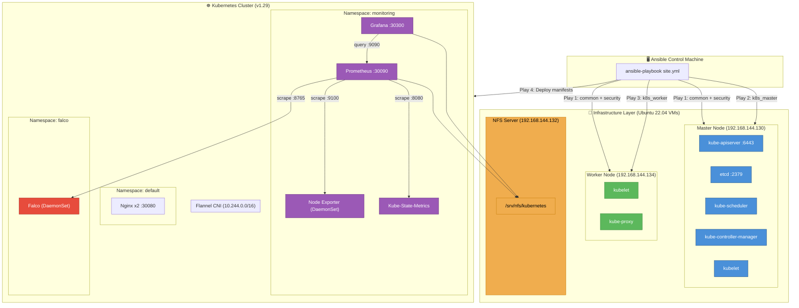
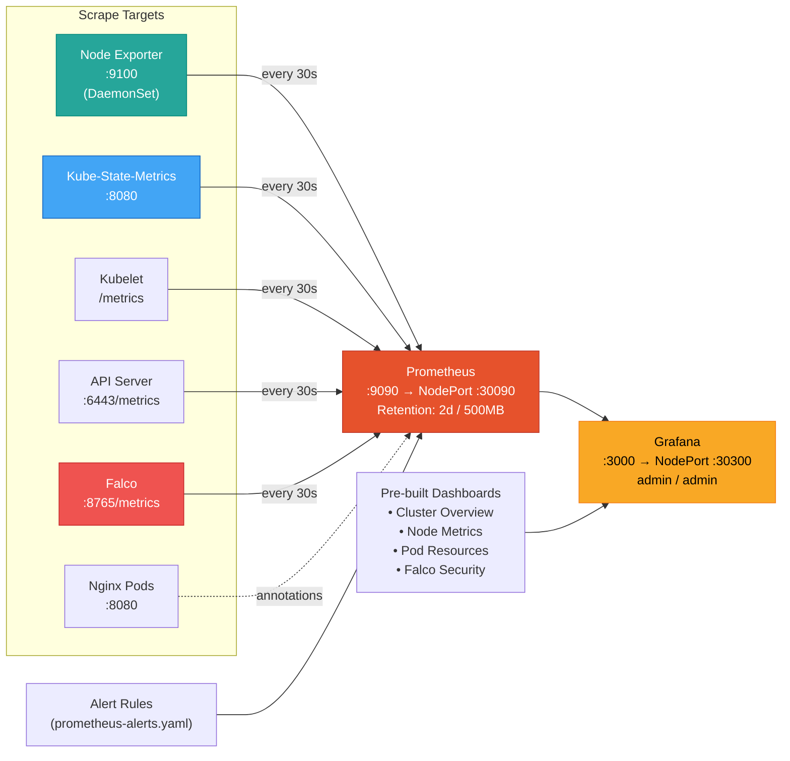
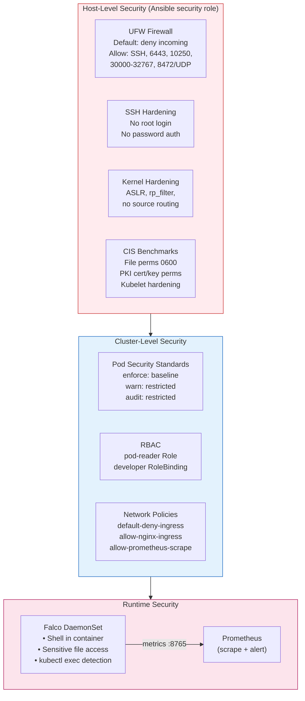
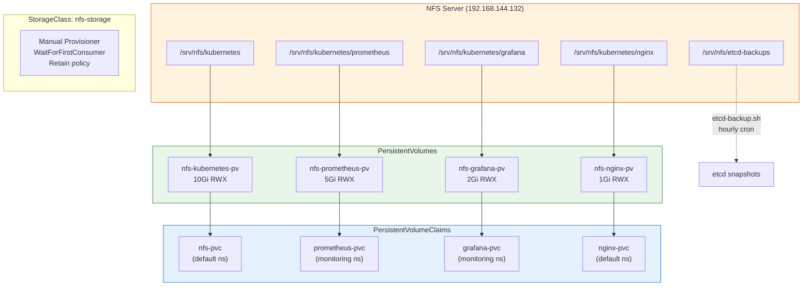
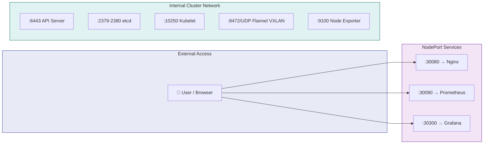
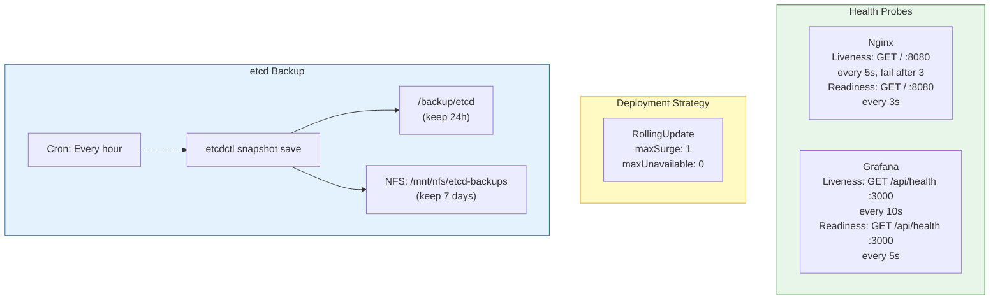

# 🏗️ Architecture Overview

> A production-ready Kubernetes cluster on Ubuntu 22.04, fully automated with Ansible, featuring monitoring, runtime security, and CIS-hardened infrastructure — optimized for an 8GB RAM, 2-node lab environment.

---

## 📁 Project Structure

```
Cdac Project/
├── ansible/                         # Infrastructure Automation
│   ├── inventory/hosts.ini          # VM IP addresses (master + worker)
│   ├── group_vars/all.yml           # Global configuration variables
│   ├── site.yml                     # Main orchestration playbook (4 plays)
│   └── roles/
│       ├── common/                  # OS prep, containerd, K8s packages
│       │   ├── tasks/main.yml       # Swap, sysctl, containerd, kubelet
│       │   └── handlers/main.yml    # Service restart handlers
│       ├── k8s_master/              # Control plane initialization
│       │   ├── tasks/main.yml       # kubeadm init, CNI, PSS, etcd backup
│       │   └── handlers/main.yml    # Service restart handlers
│       ├── k8s_worker/              # Worker node cluster join
│       │   └── tasks/main.yml       # Join command, node readiness
│       └── security/                # Host-level hardening
│           ├── tasks/main.yml       # UFW, SSH, CIS benchmarks
│           └── handlers/main.yml    # SSH/kubelet restart handlers
├── kubernetes/                      # K8s Manifests (applied by Ansible)
│   ├── monitoring/                  # Observability Stack
│   │   ├── namespace.yaml           # monitoring namespace (PSS: baseline)
│   │   ├── prometheus.yaml          # Deployment + RBAC + ConfigMap + Service
│   │   ├── prometheus-alerts.yaml   # Alert rules ConfigMap
│   │   ├── grafana.yaml             # Deployment + Datasource ConfigMap + Service
│   │   ├── grafana-dashboards.yaml  # Pre-built dashboard JSON ConfigMaps
│   │   ├── kube-state-metrics.yaml  # Deployment + RBAC + Service
│   │   └── node-exporter.yaml       # DaemonSet + Service
│   ├── nginx/                       # Sample Workload
│   │   └── deployment.yaml          # Deployment + Service (PSS-compliant)
│   ├── security/                    # Cluster Security Policies
│   │   ├── network-policy.yaml      # Default-deny + allow rules
│   │   └── pss-rbac.yaml            # PSS labels + RBAC role/binding
│   ├── storage/                     # Persistent Storage (NFS)
│   │   ├── storage-class.yaml       # nfs-storage StorageClass
│   │   ├── nfs-pv.yaml              # 4 PersistentVolumes (10Gi+5Gi+2Gi+1Gi)
│   │   └── nfs-pvc.yaml             # 4 PersistentVolumeClaims
│   └── falco/                       # Runtime Security (optional)
│       └── falco.yaml               # Namespace + RBAC + ConfigMap + DaemonSet
├── scripts/                         # Operational Scripts
│   ├── etcd-backup.sh               # Automated hourly etcd snapshot + NFS copy
│   └── diagnose-services.sh         # Cluster health diagnostic report
└── docs/                            # Documentation
    ├── Kubernetes_Cluster_Project_Document.md
    ├── Project_Explanation.md
    ├── Interview_QA_Guide.md
    ├── Updated_Interview_QA.md
    ├── interview_extra.md
    └── setup_guide.md
```

---

## 🌐 High-Level Architecture



---

## ⚙️ Ansible Automation Flow

The `site.yml` playbook orchestrates the entire deployment in **4 sequential plays**:

```mermaid
flowchart TD
    START(["▶ ansible-playbook site.yml"]) --> P1

    subgraph P1["Play 1 — All Nodes"]
        direction TB
        P1A["Disable swap"] --> P1B["Install packages<br/>(apt-transport-https, nfs-common, ...)"]
        P1B --> P1C["Load kernel modules<br/>(overlay, br_netfilter)"]
        P1C --> P1D["Configure sysctl<br/>(ip_forward, bridge-nf-call)"]
        P1D --> P1E["Install containerd<br/>(SystemdCgroup = true)"]
        P1E --> P1F["Install kubelet,<br/>kubeadm, kubectl v1.29"]
        P1F --> P1G["UFW Firewall Rules<br/>(SSH, 6443, 10250, 30000-32767)"]
        P1G --> P1H["SSH Hardening<br/>(root login, password auth)"]
        P1H --> P1I["CIS Benchmarks<br/>(file perms, kubelet config)"]
    end

    P1 --> P2

    subgraph P2["Play 2 — Master Only"]
        direction TB
        P2A["kubeadm init<br/>(--pod-network-cidr=10.244.0.0/16)"] --> P2B["Setup kubectl<br/>(root + ubuntu users)"]
        P2B --> P2C["Install Flannel CNI"]
        P2C --> P2D["Remove NoSchedule taint<br/>(allow workloads on master)"]
        P2D --> P2E["Apply Pod Security Standards<br/>(baseline enforcement)"]
        P2E --> P2F["Generate join command"]
        P2F --> P2G["Setup etcd backup cron<br/>(hourly → /backup/etcd)"]
    end

    P2 --> P3

    subgraph P3["Play 3 — Workers Only"]
        direction TB
        P3A["Get join command<br/>from master"] --> P3B["kubeadm join"]
        P3B --> P3C["Wait for node Ready"]
    end

    P3 --> P4

    subgraph P4["Play 4 — Deploy K8s Services"]
        direction TB
        P4A["Copy manifests<br/>to /opt/kubernetes/"] --> P4B["Apply storage/<br/>(StorageClass, PV, PVC)"]
        P4B --> P4C["Apply monitoring/<br/>(Prometheus, Grafana, etc.)"]
        P4C --> P4D["Apply nginx/<br/>(Deployment + Service)"]
        P4D --> P4E["Apply security/<br/>(NetworkPolicy, RBAC)"]
        P4E --> P4F{"enable_falco?"}
        P4F -->|true| P4G["Apply falco/"]
        P4F -->|false| P4H["Skip Falco"]
        P4G --> DONE
        P4H --> DONE
    end

    DONE(["✅ Cluster Ready"])

    style P1 fill:#e8f4f8,stroke:#5dade2
    style P2 fill:#fdebd0,stroke:#f39c12
    style P3 fill:#d5f5e3,stroke:#27ae60
    style P4 fill:#f5eef8,stroke:#8e44ad
```



---

## 🔍 Monitoring Architecture



---

## 🔒 Security Architecture



---

## 💾 Storage Architecture



---

## 🌐 Network & Port Map



| Service | Type | Port | NodePort | Namespace |
|---------|------|------|----------|-----------|
| Nginx | NodePort | 80 → 8080 | 30080 | default |
| Prometheus | NodePort | 9090 | 30090 | monitoring |
| Grafana | NodePort | 3000 | 30300 | monitoring |
| Node Exporter | ClusterIP | 9100 | — | monitoring |
| Kube-State-Metrics | ClusterIP | 8080 | — | monitoring |
| Falco | ClusterIP | 8765 | — | falco |

---

## 🔄 Self-Healing & Reliability



---

## 📊 Technology Stack Summary

| Layer | Technology | Purpose |
|-------|-----------|---------|
| **OS** | Ubuntu 22.04 LTS | Base VM operating system |
| **Automation** | Ansible | Infrastructure-as-Code, playbook-driven setup |
| **Container Runtime** | containerd | CRI-compliant container runtime |
| **Orchestration** | Kubernetes v1.29 | Container orchestration platform |
| **CNI** | Flannel | Pod networking (VXLAN, low RAM usage) |
| **Monitoring** | Prometheus | Metrics collection, alerting |
| **Visualization** | Grafana | Dashboards, data visualization |
| **Node Metrics** | Node Exporter | Hardware/OS metrics (DaemonSet) |
| **K8s Metrics** | Kube-State-Metrics | Kubernetes object state metrics |
| **Web Server** | Nginx (unprivileged) | Sample workload, PSS-compliant |
| **Storage** | NFS | Shared persistent storage (ReadWriteMany) |
| **Runtime Security** | Falco | Syscall monitoring, threat detection |
| **Firewall** | UFW | Host-level network security |
| **Backup** | etcdctl + cron | Automated etcd snapshots |
| **Security** | CIS Benchmarks | Compliance-aligned hardening |

---

## 🚀 Deployment Flow (End-to-End)

```
1. Configure    →  Edit hosts.ini + group_vars/all.yml with your IPs
2. Run Playbook →  ansible-playbook -i inventory/hosts.ini site.yml
3. Verify       →  kubectl get nodes && kubectl get pods -A
4. Access       →  Prometheus :30090 | Grafana :30300 | Nginx :30080
5. Monitor      →  Grafana dashboards auto-provisioned with Prometheus data
6. Backup       →  etcd snapshots every hour (local + NFS)
7. Diagnose     →  ./scripts/diagnose-services.sh (14-point health check)
```
