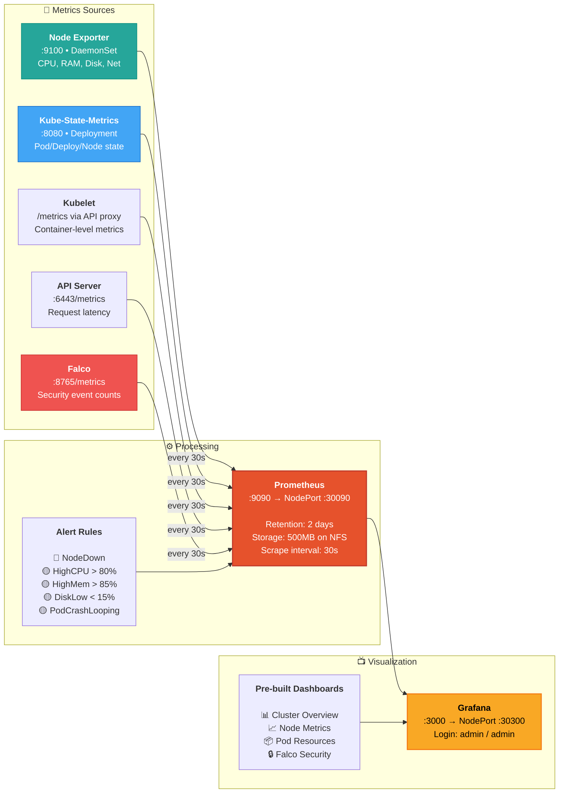
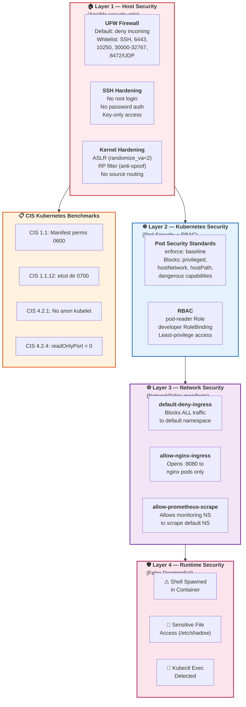
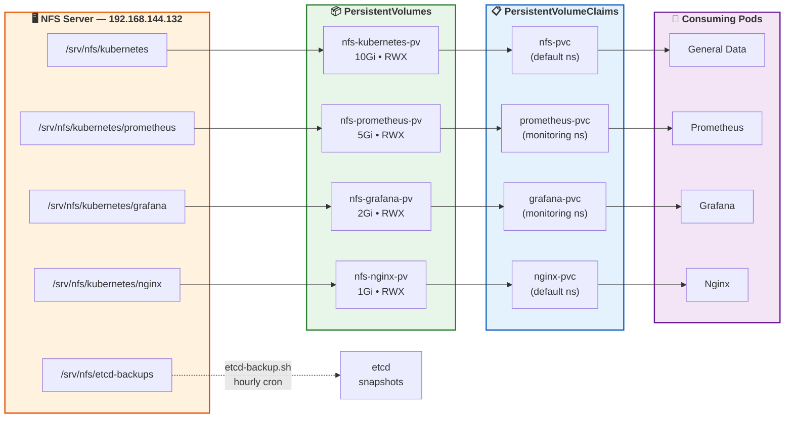
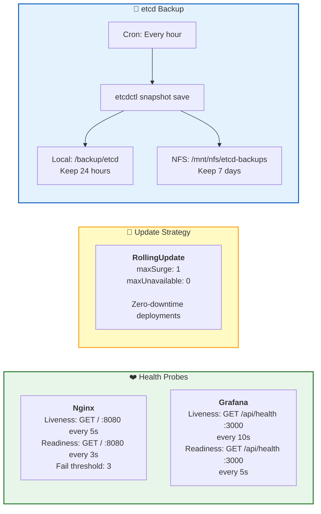

<p align="center">
  
</p>

<h1 align="center">☸️ Kubernetes Cluster Automation</h1>
<h3 align="center">Production-Ready • Ansible-Powered • Fully Observable • CIS-Hardened</h3>

<p align="center">
  
  
  
  
  
  
</p>

<p align="center">
  <b>One command. Full cluster. Zero manual steps.</b><br/>
  A production-grade Kubernetes cluster on Ubuntu 22.04, fully automated with Ansible,<br/>
  featuring monitoring, runtime security, and CIS-hardened infrastructure —<br/>
  optimized for an 8GB RAM, 2-node lab environment.
</p>

---

## 📌 What This Project Does

```
❌ WITHOUT this project                     ✅ WITH this project
──────────────────────────                  ──────────────────────────
• 50+ manual commands per node              • 1 command: ansible-playbook site.yml
• 2-3 hours of setup time                   • ~15 mins automated setup  
• No monitoring by default                  • Prometheus + Grafana from day 0
• No security hardening                     • CIS benchmarks + Falco + UFW
• Hope nothing breaks                       • Self-healing + etcd backups
• "It works on my machine"                  • 100% reproducible via IaC
```

---

## 🏗️ High-Level Architecture

```mermaid
graph TB
    subgraph CONTROL["🎛️ Ansible Control Machine"]
        direction LR
        CMD["$ ansible-playbook site.yml"]
    end

    subgraph CLUSTER["☸️ Kubernetes Cluster v1.29"]
        direction TB
        
        subgraph MASTER["🖥️ Master Node — 192.168.144.130"]
            direction TB
            API["🔌 API Server\n:6443"]
            ETCD["💾 etcd\n:2379"]
            SCHED["📋 Scheduler"]
            CM["🔄 Controller\nManager"]
        end

        subgraph WORKER["🖥️ Worker Node — 192.168.144.134"]
            direction TB
            KP["🔀 kube-proxy"]
            KL["⚙️ kubelet"]
        end

        subgraph NETWORK["🌐 Flannel CNI — 10.244.0.0/16 VXLAN Overlay"]
            direction LR
            NET_NOTE["Pod-to-Pod networking across nodes"]
        end
    end

    subgraph SERVICES["📦 Deployed Services"]
        direction TB
        
        subgraph MON["📊 Monitoring Stack"]
            direction LR
            PROM["Prometheus\n:30090"]
            GRAF["Grafana\n:30300"]
            NE["Node Exporter\n:9100"]
            KSM["Kube-State\nMetrics :8080"]
        end

        subgraph APP["🚀 Application"]
            NGINX["Nginx x2\n:30080"]
        end

        subgraph SEC["🛡️ Security"]
            FALCO["Falco\nDaemonSet"]
            NP["Network\nPolicies"]
            PSS["Pod Security\nStandards"]
        end
    end

    subgraph STORAGE["💾 NFS Server — 192.168.144.132"]
        direction TB
        NFS1["/srv/nfs/kubernetes/prometheus — 5Gi"]
        NFS2["/srv/nfs/kubernetes/grafana — 2Gi"]
        NFS3["/srv/nfs/kubernetes/nginx — 1Gi"]
        NFS4["/srv/nfs/etcd-backups — 7 days"]
    end

    CMD -->|"SSH — Play 1: OS + Security"| MASTER
    CMD -->|"SSH — Play 1: OS + Security"| WORKER
    CMD -->|"Play 2: kubeadm init"| MASTER
    CMD -->|"Play 3: kubeadm join"| WORKER
    CMD -->|"Play 4: kubectl apply"| SERVICES

    PROM -->|"scrape /metrics"| NE
    PROM -->|"scrape /metrics"| KSM
    PROM -->|"scrape /metrics"| FALCO
    GRAF -->|"PromQL queries"| PROM

    PROM -.->|"PVC"| NFS1
    GRAF -.->|"PVC"| NFS2
    NGINX -.->|"PVC"| NFS3
    ETCD -.->|"cron backup"| NFS4

    classDef master fill:#4a90d9,stroke:#2d5986,color:#fff,stroke-width:2px
    classDef worker fill:#5cb85c,stroke:#3d8b3d,color:#fff,stroke-width:2px
    classDef monitoring fill:#9b59b6,stroke:#6c3483,color:#fff,stroke-width:2px
    classDef security fill:#e74c3c,stroke:#a93226,color:#fff,stroke-width:2px
    classDef storage fill:#f0ad4e,stroke:#c87f0a,color:#000,stroke-width:2px
    classDef app fill:#17a2b8,stroke:#117a8b,color:#fff,stroke-width:2px

    class API,ETCD,SCHED,CM master
    class KP,KL worker
    class PROM,GRAF,NE,KSM monitoring
    class FALCO,NP,PSS security
    class NFS1,NFS2,NFS3,NFS4 storage
    class NGINX app
```



---

## ⚙️ Automation Flow — What Happens When You Run `site.yml`

```mermaid
flowchart TD
    START(["▶ ansible-playbook -i inventory/hosts.ini site.yml"])
    START --> P1

    subgraph P1["🔧 Play 1 — ALL Nodes: OS Preparation + Security Hardening"]
        direction TB
        P1A["1. Disable swap\n<code>swapoff -a</code>"]
        P1B["2. Install packages\napt-transport-https\nnfs-common, curl"]
        P1C["3. Load kernel modules\n<code>modprobe overlay</code>\n<code>modprobe br_netfilter</code>"]
        P1D["4. Configure sysctl\nip_forward = 1\nbridge-nf-call-iptables = 1"]
        P1E["5. Install containerd\nSet SystemdCgroup = true"]
        P1F["6. Install K8s v1.29\nkubelet + kubeadm + kubectl"]
        P1G["7. UFW Firewall\nDeny incoming by default\nAllow: SSH, 6443, 10250, .."]
        P1H["8. SSH Hardening\nNo root login\nNo password auth"]
        P1I["9. CIS Benchmarks\nFile perms 0600\nDisable anon kubelet auth"]
        
        P1A --> P1B --> P1C --> P1D --> P1E --> P1F --> P1G --> P1H --> P1I
    end

    P1 --> P2

    subgraph P2["👑 Play 2 — MASTER Only: Control Plane Init"]
        direction TB
        P2A["1. kubeadm init\n--pod-network-cidr=10.244.0.0/16\n--cri-socket=containerd"]
        P2B["2. Setup kubectl\nfor root + ubuntu users"]
        P2C["3. Install Flannel CNI\nVXLAN overlay network"]
        P2D["4. Remove NoSchedule taint\nAllow workloads on master"]
        P2E["5. Apply PSS Labels\nenforce: baseline"]
        P2F["6. Generate join command\nfor worker nodes"]
        P2G["7. Setup etcd backup cron\nHourly snapshots → NFS"]

        P2A --> P2B --> P2C --> P2D --> P2E --> P2F --> P2G
    end

    P2 --> P3

    subgraph P3["🔗 Play 3 — WORKERS Only: Join Cluster"]
        direction TB
        P3A["1. Get join command\nfrom master via Ansible"]
        P3B["2. kubeadm join\nwith token + CA hash"]
        P3C["3. Wait for node Ready\nPolls kubectl get node"]

        P3A --> P3B --> P3C
    end

    P3 --> P4

    subgraph P4["📦 Play 4 — Deploy Services"]
        direction TB
        P4A["1. Copy manifests\n→ /opt/kubernetes/"]
        P4B["2. kubectl apply storage/\nStorageClass + PV + PVC"]
        P4C["3. kubectl apply monitoring/\nPrometheus + Grafana\nNode Exporter + KSM"]
        P4D["4. kubectl apply nginx/\nDeployment + Service"]
        P4E["5. kubectl apply security/\nNetworkPolicy + RBAC"]
        P4F{"Falco\nenabled?"}
        P4G["6. kubectl apply falco/\nNamespace + DaemonSet"]
        P4H["Skip"]

        P4A --> P4B --> P4C --> P4D --> P4E --> P4F
        P4F -->|"Yes"| P4G
        P4F -->|"No"| P4H
    end

    P4G --> DONE
    P4H --> DONE
    DONE(["✅ Cluster Ready!\nPrometheus :30090\nGrafana :30300\nNginx :30080"])

    style P1 fill:#e8f4f8,stroke:#5dade2,stroke-width:2px
    style P2 fill:#fdebd0,stroke:#f39c12,stroke-width:2px
    style P3 fill:#d5f5e3,stroke:#27ae60,stroke-width:2px
    style P4 fill:#f5eef8,stroke:#8e44ad,stroke-width:2px
    style DONE fill:#d4edda,stroke:#28a745,stroke-width:3px,color:#000
```



---

## 📊 Monitoring Architecture



---

## 🔒 Security — 4-Layer Defense



---

## 💾 Storage Architecture



---

## 🌐 Network & Port Map

| Service | Type | Container Port | NodePort | Namespace | Access URL |
|---------|------|:--------------:|:--------:|-----------|------------|
| **Nginx** | NodePort | 8080 | **30080** | default | `http://<node-ip>:30080` |
| **Prometheus** | NodePort | 9090 | **30090** | monitoring | `http://<node-ip>:30090` |
| **Grafana** | NodePort | 3000 | **30300** | monitoring | `http://<node-ip>:30300` |
| **Node Exporter** | ClusterIP | 9100 | — | monitoring | Internal only |
| **Kube-State-Metrics** | ClusterIP | 8080 | — | monitoring | Internal only |
| **Falco** | ClusterIP | 8765 | — | falco | Internal only |

---

## 📊 Technology Stack

| Layer | Technology | Why This Choice |
|-------|-----------|-----------------|
| **OS** | Ubuntu 22.04 LTS | Long-term support, wide community, ideal for K8s |
| **Automation** | Ansible | Agentless, YAML-based, perfect for server configuration |
| **Container Runtime** | containerd | Official CRI for K8s 1.24+, lighter than Docker (~50MB) |
| **Orchestration** | Kubernetes v1.29 | Industry-standard container orchestration |
| **CNI** | Flannel | Lightweight VXLAN (~50MB RAM), ideal for small clusters |
| **Monitoring** | Prometheus | Pull-based, PromQL, Kubernetes-native service discovery |
| **Visualization** | Grafana | Rich dashboards, multi-datasource, free & open-source |
| **Node Metrics** | Node Exporter | Exposes hardware/OS metrics for Prometheus |
| **K8s Metrics** | Kube-State-Metrics | Exposes Kubernetes object state as metrics |
| **Web Server** | Nginx (unprivileged) | PSS-compliant sample workload with self-healing |
| **Storage** | NFS | ReadWriteMany support, simple, external to cluster |
| **Runtime Security** | Falco | Syscall-level threat detection via eBPF |
| **Firewall** | UFW | Ubuntu-native, simple rule management |
| **Backup** | etcdctl + cron | Automated hourly cluster state snapshots |
| **Compliance** | CIS Benchmarks | Industry-standard security hardening |

---

## 🔄 Self-Healing & Reliability



---

## 🚀 Quick Start

### Prerequisites

| # | Requirement | Details |
|---|---|---|
| 1 | **Ubuntu 22.04 VMs** | At least 2 — one Master, one Worker |
| 2 | **NFS Server** | Ubuntu server with `/srv/nfs/kubernetes` exported |
| 3 | **Ansible** | Installed on your control machine |
| 4 | **SSH Key Access** | Passwordless SSH to all VMs |

### Setup in 4 Steps

```bash
# 1. Clone the repository
git clone https://github.com/Electrov201/Kubernetes_Cdac_Project.git
cd Kubernetes_Cdac_Project

# 2. Update inventory with YOUR VM IPs
nano ansible/inventory/hosts.ini

# 3. Update variables (NFS server IP, etc.)
nano ansible/group_vars/all.yml

# 4. Run the playbook — sit back and watch!
cd ansible
ansible-playbook -i inventory/hosts.ini site.yml
```

### ✅ Verify It Worked

```bash
# Check nodes are Ready
kubectl get nodes -o wide

# Check all pods are Running
kubectl get pods --all-namespaces

# Test self-healing (delete a pod, watch it recreate)
kubectl delete pod <nginx-pod-name>
kubectl get pods -w
```

### 🖥️ Access Services

| Service | URL | Credentials |
|---------|-----|-------------|
| **Prometheus** | `http://<master-ip>:30090` | No login |
| **Grafana** | `http://<master-ip>:30300` | `admin` / `admin` |
| **Nginx** | `http://<master-ip>:30080` | No login |

---

## 📁 Project Structure

```
Kubernetes_Cdac_Project/
│
├── 📂 ansible/                              # Infrastructure Automation
│   ├── 📂 inventory/
│   │   └── 📄 hosts.ini                     # Target VM IPs + SSH config
│   ├── 📂 group_vars/
│   │   └── 📄 all.yml                       # All configurable variables
│   ├── 📄 site.yml                          # Main playbook (4 plays)
│   └── 📂 roles/
│       ├── 📂 common/                       # OS prep, containerd, K8s packages
│       │   ├── 📄 tasks/main.yml            # 13 tasks for node preparation
│       │   └── 📄 handlers/main.yml         # Service restart handlers
│       ├── 📂 k8s_master/                   # Control plane initialization
│       │   ├── 📄 tasks/main.yml            # kubeadm init, CNI, PSS, backup
│       │   └── 📄 handlers/main.yml         # Service restart handlers
│       ├── 📂 k8s_worker/                   # Worker node join
│       │   └── 📄 tasks/main.yml            # kubeadm join + readiness wait
│       └── 📂 security/                     # Host-level hardening
│           ├── 📄 tasks/main.yml            # UFW, SSH, CIS benchmarks (34 tasks)
│           └── 📄 handlers/main.yml         # SSH + kubelet restart handlers
│
├── 📂 kubernetes/                           # K8s Manifests (applied by Ansible)
│   ├── 📂 monitoring/                       # Observability stack
│   │   ├── 📄 namespace.yaml               # monitoring NS (PSS: baseline)
│   │   ├── 📄 prometheus.yaml              # RBAC + ConfigMap + Deployment + Service
│   │   ├── 📄 prometheus-alerts.yaml        # Alert rules ConfigMap
│   │   ├── 📄 grafana.yaml                  # Datasource + Deployment + Service
│   │   ├── 📄 grafana-dashboards.yaml       # Pre-built dashboard JSONs
│   │   ├── 📄 kube-state-metrics.yaml       # RBAC + Deployment + Service
│   │   └── 📄 node-exporter.yaml            # DaemonSet + Service
│   ├── 📂 nginx/                            # Sample workload
│   │   └── 📄 deployment.yaml              # PSS-compliant Deployment + Service
│   ├── 📂 security/                         # Cluster security policies
│   │   ├── 📄 network-policy.yaml           # default-deny + allow rules
│   │   └── 📄 pss-rbac.yaml                # PSS labels + RBAC role/binding
│   ├── 📂 storage/                          # Persistent storage (NFS)
│   │   ├── 📄 storage-class.yaml            # nfs-storage StorageClass
│   │   ├── 📄 nfs-pv.yaml                  # 4 PersistentVolumes
│   │   └── 📄 nfs-pvc.yaml                 # 4 PersistentVolumeClaims
│   └── 📂 falco/                            # Runtime security (optional)
│       └── 📄 falco.yaml                    # NS + RBAC + Config + DaemonSet
│
├── 📂 scripts/                              # Operational scripts
│   ├── 📄 etcd-backup.sh                    # Hourly etcd snapshot + NFS copy
│   └── 📄 diagnose-services.sh              # 14-point cluster health check
│
├── 📂 docs/                                 # Documentation
│   ├── 📄 Kubernetes_Cluster_Project_Document.md  # Complete project documentation
│   ├── 📄 Project_Explanation.md            # Project explanation guide
│   ├── 📄 Interview_QA_Guide.md             # Interview Q&A reference
│   ├── 📄 Updated_Interview_QA.md           # Extended interview guide
│   ├── 📄 interview_extra.md                # Additional interview prep
│   └── 📄 setup_guide.md                    # Step-by-step setup instructions
│
└── 📄 README.md                             # ← You are here
```

---

## 🔧 Configuration Reference

All settings live in `ansible/group_vars/all.yml`:

| Variable | Default | Description |
|----------|---------|-------------|
| `kubernetes_version` | `1.29` | Kubernetes version to install |
| `api_server_advertise_address` | `192.168.144.130` | Master node IP address |
| `pod_network_cidr` | `10.244.0.0/16` | Pod IP range (must match Flannel) |
| `cni_plugin` | `flannel` | CNI plugin (`flannel` or `calico`) |
| `nfs_server` | `192.168.144.132` | NFS server IP for persistent storage |
| `prometheus_nodeport` | `30090` | Prometheus UI access port |
| `grafana_nodeport` | `30300` | Grafana UI access port |
| `nginx_replicas` | `2` | Nginx pod replicas (optimized for 8GB) |
| `enable_falco` | `true` | Enable runtime security monitoring |
| `pss_level` | `baseline` | Pod Security Standards enforcement level |
| `enable_firewall` | `true` | Enable UFW firewall hardening |
| `allow_master_scheduling` | `true` | Allow pods on master node |

---

## 📈 Scaling Capabilities

| Component | Current | Scaling Method | Notes |
|-----------|:-------:|----------------|-------|
| **Nginx** | 2 replicas | `kubectl scale deployment nginx --replicas=N` | ✅ Manual horizontal scaling |
| **Node Exporter** | DaemonSet | Auto-scales with nodes | ✅ Automatic |
| **Falco** | DaemonSet | Auto-scales with nodes | ✅ Automatic |
| **Prometheus** | 1 replica | Single instance by design | ⚠️ Thanos needed for HA |
| **Grafana** | 1 replica | Needs shared storage for HA | ⚠️ NFS already supports it |

> **Note**: This project is optimized for an **8GB RAM, 2-node lab**. For production scaling, add Metrics Server + HPA.

---

## 🚀 End-to-End Deployment Flow

```
   ┌──────────────┐     ┌──────────────────┐     ┌────────────────┐
   │  1. CONFIGURE │────▶│  2. RUN PLAYBOOK  │────▶│  3. VERIFY     │
   │               │     │                    │     │                │
   │ hosts.ini     │     │ ansible-playbook   │     │ kubectl get    │
   │ all.yml       │     │ site.yml           │     │ nodes && pods  │
   └──────────────┘     └──────────────────┘     └───────┬────────┘
                                                          │
   ┌──────────────┐     ┌──────────────────┐     ┌───────▼────────┐
   │  6. BACKUP   │◀────│  5. MONITOR       │◀────│  4. ACCESS     │
   │               │     │                    │     │                │
   │ etcd snapshots│     │ Grafana dashboards │     │ :30090 Prom    │
   │ every hour    │     │ auto-provisioned   │     │ :30300 Grafana │
   └──────────────┘     └──────────────────┘     │ :30080 Nginx   │
                                                  └────────────────┘
```

---

## 📚 Documentation

| Document | Description |
|----------|-------------|
| [📘 Complete Project Documentation](docs/Kubernetes_Cluster_Project_Document.md) | Full technical deep-dive with "what & why" for every component |
| [📖 Project Explanation](docs/Project_Explanation.md) | Concise project overview |
| [🎤 Interview Q&A Guide](docs/Interview_QA_Guide.md) | Interview preparation reference |
| [📝 Updated Interview Q&A](docs/Updated_Interview_QA.md) | Extended interview guide with scenarios |
| [🔧 Setup Guide](docs/setup_guide.md) | Step-by-step setup instructions |

---

## 📋 Feature Checklist

| Feature | Status | Technology |
|---------|:------:|------------|
| One-command cluster deployment | ✅ | Ansible |
| Container runtime (CRI-compliant) | ✅ | containerd |
| Pod networking (CNI) | ✅ | Flannel VXLAN |
| Metrics collection | ✅ | Prometheus |
| Dashboard visualization | ✅ | Grafana (pre-built dashboards) |
| Host-level metrics | ✅ | Node Exporter (DaemonSet) |
| K8s object metrics | ✅ | Kube-State-Metrics |
| Persistent storage (RWX) | ✅ | NFS PersistentVolumes |
| Firewall hardening | ✅ | UFW (deny-by-default) |
| SSH hardening | ✅ | Key-only, no root login |
| CIS Kubernetes Benchmarks | ✅ | Ansible security role |
| Pod Security Standards | ✅ | Baseline enforcement |
| Network Policies | ✅ | Zero-trust (default deny) |
| RBAC | ✅ | Least-privilege roles |
| Runtime threat detection | ✅ | Falco (syscall monitoring) |
| Self-healing workloads | ✅ | Liveness + Readiness probes |
| Rolling updates | ✅ | Zero-downtime deployments |
| Automated backups | ✅ | etcd hourly snapshots |
| Cluster diagnostics | ✅ | 14-point health check script |
| Alert rules | ✅ | Prometheus alerting |

---

<p align="center">
  <b>Built with ❤️ as part of the CDAC program</b><br/>
  <i>Demonstrating production-grade DevOps practices in a resource-constrained environment</i>
</p>
