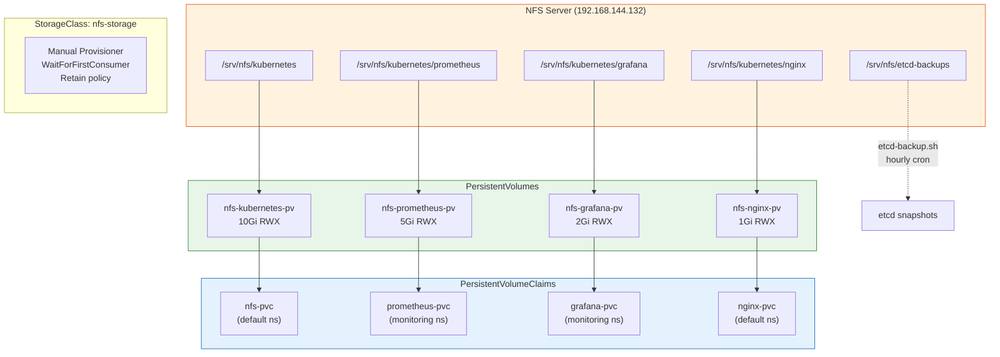
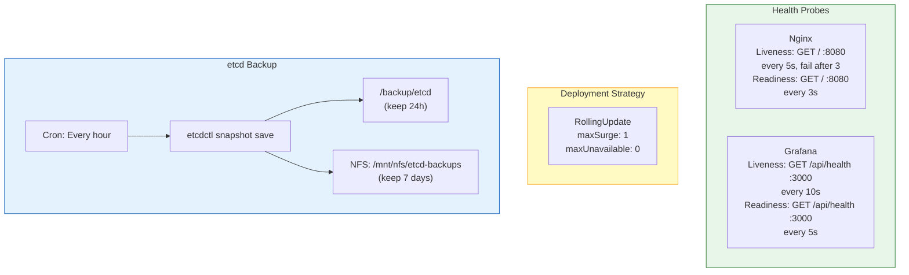

# Kubernetes Cluster Setup with Ansible Automation

> A production-ready Kubernetes cluster on Ubuntu 22.04, fully automated with Ansible, featuring monitoring, runtime security, and CIS-hardened infrastructure — optimized for an 8GB RAM, 2-node lab environment.

---

## 🌐 High-Level Architecture

```mermaid
graph TB
    subgraph CONTROL["🖥️ Ansible Control Machine"]
        A["ansible-playbook site.yml"]
    end

    subgraph INFRA["🏢 Infrastructure Layer (Ubuntu 22.04 VMs)"]
        subgraph MASTER["Master Node (192.168.144.130)"]
            API["kube-apiserver :6443"]
            ETCD["etcd :2379"]
            SCHED["kube-scheduler"]
            CM["kube-controller-manager"]
            KUBELET_M["kubelet"]
        end
        subgraph WORKER["Worker Node (192.168.144.134)"]
            KUBELET_W["kubelet"]
            KPROXY["kube-proxy"]
        end
        subgraph NFS_SRV["NFS Server (192.168.144.132)"]
            NFS_SHARE["/srv/nfs/kubernetes"]
        end
    end

    subgraph K8S["☸️ Kubernetes Cluster (v1.29)"]
        subgraph FLANNEL["Flannel CNI (10.244.0.0/16)"]
            direction LR
        end
        subgraph NS_MON["Namespace: monitoring"]
            PROM["Prometheus :30090"]
            GRAF["Grafana :30300"]
            NE["Node Exporter (DaemonSet)"]
            KSM["Kube-State-Metrics"]
        end
        subgraph NS_DEF["Namespace: default"]
            NGINX["Nginx x2 :30080"]
        end
        subgraph NS_FALCO["Namespace: falco"]
            FALCO["Falco (DaemonSet)"]
        end
    end

    A -->|"Play 1: common + security"| MASTER
    A -->|"Play 1: common + security"| WORKER
    A -->|"Play 2: k8s_master"| MASTER
    A -->|"Play 3: k8s_worker"| WORKER
    A -->|"Play 4: Deploy manifests"| K8S

    PROM -->|scrape :9100| NE
    PROM -->|scrape :8080| KSM
    PROM -->|scrape :8765| FALCO
    GRAF -->|query :9090| PROM
    PROM --> NFS_SHARE
    GRAF --> NFS_SHARE

    classDef master fill:#4a90d9,stroke:#2d5986,color:#fff
    classDef worker fill:#5cb85c,stroke:#3d8b3d,color:#fff
    classDef nfs fill:#f0ad4e,stroke:#c87f0a,color:#000
    classDef monitoring fill:#9b59b6,stroke:#6c3483,color:#fff
    classDef security fill:#e74c3c,stroke:#a93226,color:#fff

    class API,ETCD,SCHED,CM,KUBELET_M master
    class KUBELET_W,KPROXY worker
    class NFS_SRV,NFS_SHARE nfs
    class PROM,GRAF,NE,KSM monitoring
    class FALCO security
```



---

## ⚙️ Ansible Automation Flow

The `site.yml` playbook orchestrates the entire deployment in **4 sequential plays**:

```mermaid
flowchart TD
    START(["▶ ansible-playbook site.yml"]) --> P1

    subgraph P1["Play 1 — All Nodes"]
        direction TB
        P1A["Disable swap"] --> P1B["Install packages<br/>(apt-transport-https, nfs-common, ...)"]
        P1B --> P1C["Load kernel modules<br/>(overlay, br_netfilter)"]
        P1C --> P1D["Configure sysctl<br/>(ip_forward, bridge-nf-call)"]
        P1D --> P1E["Install containerd<br/>(SystemdCgroup = true)"]
        P1E --> P1F["Install kubelet,<br/>kubeadm, kubectl v1.29"]
        P1F --> P1G["UFW Firewall Rules<br/>(SSH, 6443, 10250, 30000-32767)"]
        P1G --> P1H["SSH Hardening<br/>(root login, password auth)"]
        P1H --> P1I["CIS Benchmarks<br/>(file perms, kubelet config)"]
    end

    P1 --> P2

    subgraph P2["Play 2 — Master Only"]
        direction TB
        P2A["kubeadm init<br/>(--pod-network-cidr=10.244.0.0/16)"] --> P2B["Setup kubectl<br/>(root + ubuntu users)"]
        P2B --> P2C["Install Flannel CNI"]
        P2C --> P2D["Remove NoSchedule taint<br/>(allow workloads on master)"]
        P2D --> P2E["Apply Pod Security Standards<br/>(baseline enforcement)"]
        P2E --> P2F["Generate join command"]
        P2F --> P2G["Setup etcd backup cron<br/>(hourly → /backup/etcd)"]
    end

    P2 --> P3

    subgraph P3["Play 3 — Workers Only"]
        direction TB
        P3A["Get join command<br/>from master"] --> P3B["kubeadm join"]
        P3B --> P3C["Wait for node Ready"]
    end

    P3 --> P4

    subgraph P4["Play 4 — Deploy K8s Services"]
        direction TB
        P4A["Copy manifests<br/>to /opt/kubernetes/"] --> P4B["Apply storage/<br/>(StorageClass, PV, PVC)"]
        P4B --> P4C["Apply monitoring/<br/>(Prometheus, Grafana, etc.)"]
        P4C --> P4D["Apply nginx/<br/>(Deployment + Service)"]
        P4D --> P4E["Apply security/<br/>(NetworkPolicy, RBAC)"]
        P4E --> P4F{"enable_falco?"}
        P4F -->|true| P4G["Apply falco/"]
        P4F -->|false| P4H["Skip Falco"]
        P4G --> DONE
        P4H --> DONE
    end

    DONE(["✅ Cluster Ready"])

    style P1 fill:#e8f4f8,stroke:#5dade2
    style P2 fill:#fdebd0,stroke:#f39c12
    style P3 fill:#d5f5e3,stroke:#27ae60
    style P4 fill:#f5eef8,stroke:#8e44ad
```



---

## 🔍 Monitoring Architecture

```mermaid
graph LR
    subgraph TARGETS["Scrape Targets"]
        NE["Node Exporter<br/>:9100<br/>(DaemonSet)"]
        KSM["Kube-State-Metrics<br/>:8080"]
        KUBELET["Kubelet<br/>/metrics"]
        APISVR["API Server<br/>:6443/metrics"]
        FALCO["Falco<br/>:8765/metrics"]
        NGINX["Nginx Pods<br/>:8080"]
    end

    PROM["Prometheus<br/>:9090 → NodePort :30090<br/>Retention: 2d / 500MB"]

    GRAF["Grafana<br/>:3000 → NodePort :30300<br/>admin / admin"]

    ALERTS["Alert Rules<br/>(prometheus-alerts.yaml)"]

    DASH["Pre-built Dashboards<br/>• Cluster Overview<br/>• Node Metrics<br/>• Pod Resources<br/>• Falco Security"]

    NE -->|every 30s| PROM
    KSM -->|every 30s| PROM
    KUBELET -->|every 30s| PROM
    APISVR -->|every 30s| PROM
    FALCO -->|every 30s| PROM
    NGINX -.->|annotations| PROM

    ALERTS --> PROM
    PROM --> GRAF
    DASH --> GRAF

    style PROM fill:#e6522c,stroke:#c0392b,color:#fff
    style GRAF fill:#f9a825,stroke:#f57f17,color:#000
    style NE fill:#26a69a,stroke:#00897b,color:#fff
    style KSM fill:#42a5f5,stroke:#1565c0,color:#fff
    style FALCO fill:#ef5350,stroke:#c62828,color:#fff
```



---

## 🔒 Security Architecture

```mermaid
graph TB
    subgraph HOST["Host-Level Security (Ansible security role)"]
        FW["UFW Firewall<br/>Default: deny incoming<br/>Allow: SSH, 6443, 10250,<br/>30000-32767, 8472/UDP"]
        SSH["SSH Hardening<br/>No root login<br/>No password auth"]
        KERN["Kernel Hardening<br/>ASLR, rp_filter,<br/>no source routing"]
        CIS["CIS Benchmarks<br/>File perms 0600<br/>PKI cert/key perms<br/>Kubelet hardening"]
    end

    subgraph CLUSTER["Cluster-Level Security"]
        PSS["Pod Security Standards<br/>enforce: baseline<br/>warn: restricted<br/>audit: restricted"]
        RBAC["RBAC<br/>pod-reader Role<br/>developer RoleBinding"]
        NP["Network Policies<br/>default-deny-ingress<br/>allow-nginx-ingress<br/>allow-prometheus-scrape"]
    end

    subgraph RUNTIME["Runtime Security"]
        FALCO_R["Falco DaemonSet<br/>• Shell in container<br/>• Sensitive file access<br/>• kubectl exec detection"]
        FALCO_R -->|metrics :8765| PROM_R["Prometheus<br/>(scrape + alert)"]
    end

    HOST --> CLUSTER --> RUNTIME

    style HOST fill:#ffebee,stroke:#c62828
    style CLUSTER fill:#e3f2fd,stroke:#1565c0
    style RUNTIME fill:#fce4ec,stroke:#ad1457
```



---

## 💾 Storage Architecture



---

## 🌐 Network & Port Map

```mermaid
graph LR
    subgraph EXTERNAL["External Access"]
        USER["👤 User / Browser"]
    end

    subgraph NODEPORTS["NodePort Services"]
        NP1[":30080 → Nginx"]
        NP2[":30090 → Prometheus"]
        NP3[":30300 → Grafana"]
    end

    subgraph INTERNAL["Internal Cluster Network"]
        K8S_API[":6443 API Server"]
        ETCD_P[":2379-2380 etcd"]
        KUBELET_P[":10250 Kubelet"]
        FLANNEL_P[":8472/UDP Flannel VXLAN"]
        NE_P[":9100 Node Exporter"]
    end

    USER --> NP1
    USER --> NP2
    USER --> NP3

    style EXTERNAL fill:#e8eaf6,stroke:#283593
    style NODEPORTS fill:#f3e5f5,stroke:#6a1b9a
    style INTERNAL fill:#e0f2f1,stroke:#00695c
```



| Service | Type | Port | NodePort | Namespace |
|---------|------|------|----------|-----------|
| Nginx | NodePort | 80 → 8080 | 30080 | default |
| Prometheus | NodePort | 9090 | 30090 | monitoring |
| Grafana | NodePort | 3000 | 30300 | monitoring |
| Node Exporter | ClusterIP | 9100 | — | monitoring |
| Kube-State-Metrics | ClusterIP | 8080 | — | monitoring |
| Falco | ClusterIP | 8765 | — | falco |

---

## 🔄 Self-Healing & Reliability



---

## 📊 Technology Stack Summary

| Layer | Technology | Purpose |
|-------|-----------|---------|
| **OS** | Ubuntu 22.04 LTS | Base VM operating system |
| **Automation** | Ansible | Infrastructure-as-Code, playbook-driven setup |
| **Container Runtime** | containerd | CRI-compliant container runtime |
| **Orchestration** | Kubernetes v1.29 | Container orchestration platform |
| **CNI** | Flannel | Pod networking (VXLAN, low RAM usage) |
| **Monitoring** | Prometheus | Metrics collection, alerting |
| **Visualization** | Grafana | Dashboards, data visualization |
| **Node Metrics** | Node Exporter | Hardware/OS metrics (DaemonSet) |
| **K8s Metrics** | Kube-State-Metrics | Kubernetes object state metrics |
| **Web Server** | Nginx (unprivileged) | Sample workload, PSS-compliant |
| **Storage** | NFS | Shared persistent storage (ReadWriteMany) |
| **Runtime Security** | Falco | Syscall monitoring, threat detection |
| **Firewall** | UFW | Host-level network security |
| **Backup** | etcdctl + cron | Automated etcd snapshots |
| **Security** | CIS Benchmarks | Compliance-aligned hardening |

---

## 🚀 Quick Start

### Prerequisites

1. **Ubuntu 22.04 VMs** (Master + Worker nodes)
2. **Ansible installed** on your control machine
3. **SSH key access** to all VMs

### Setup Steps

```bash
# 1. Clone/Copy project to your Ansible control machine
cd "Cdac Project"

# 2. Update inventory with your VM IPs
nano ansible/inventory/hosts.ini

# 3. Update variables (NFS server, etc.)
nano ansible/group_vars/all.yml

# 4. Run the playbook
cd ansible
ansible-playbook -i inventory/hosts.ini site.yml
```

## 📁 Project Structure

```
Cdac Project/
├── ansible/                         # Infrastructure Automation
│   ├── inventory/hosts.ini          # VM IP addresses (master + worker)
│   ├── group_vars/all.yml           # Global configuration variables
│   ├── site.yml                     # Main orchestration playbook (4 plays)
│   └── roles/
│       ├── common/                  # OS prep, containerd, K8s packages
│       │   ├── tasks/main.yml       # Swap, sysctl, containerd, kubelet
│       │   └── handlers/main.yml    # Service restart handlers
│       ├── k8s_master/              # Control plane initialization
│       │   ├── tasks/main.yml       # kubeadm init, CNI, PSS, etcd backup
│       │   └── handlers/main.yml    # Service restart handlers
│       ├── k8s_worker/              # Worker node cluster join
│       │   └── tasks/main.yml       # Join command, node readiness
│       └── security/                # Host-level hardening
│           ├── tasks/main.yml       # UFW, SSH, CIS benchmarks
│           └── handlers/main.yml    # SSH/kubelet restart handlers
├── kubernetes/                      # K8s Manifests (applied by Ansible)
│   ├── monitoring/                  # Observability Stack
│   │   ├── namespace.yaml           # monitoring namespace (PSS: baseline)
│   │   ├── prometheus.yaml          # Deployment + RBAC + ConfigMap + Service
│   │   ├── prometheus-alerts.yaml   # Alert rules ConfigMap
│   │   ├── grafana.yaml             # Deployment + Datasource ConfigMap + Service
│   │   ├── grafana-dashboards.yaml  # Pre-built dashboard JSON ConfigMaps
│   │   ├── kube-state-metrics.yaml  # Deployment + RBAC + Service
│   │   └── node-exporter.yaml       # DaemonSet + Service
│   ├── nginx/                       # Sample Workload
│   │   └── deployment.yaml          # Deployment + Service (PSS-compliant)
│   ├── security/                    # Cluster Security Policies
│   │   ├── network-policy.yaml      # Default-deny + allow rules
│   │   └── pss-rbac.yaml            # PSS labels + RBAC role/binding
│   ├── storage/                     # Persistent Storage (NFS)
│   │   ├── storage-class.yaml       # nfs-storage StorageClass
│   │   ├── nfs-pv.yaml              # 4 PersistentVolumes (10Gi+5Gi+2Gi+1Gi)
│   │   └── nfs-pvc.yaml             # 4 PersistentVolumeClaims
│   └── falco/                       # Runtime Security (optional)
│       └── falco.yaml               # Namespace + RBAC + ConfigMap + DaemonSet
├── scripts/                         # Operational Scripts
│   ├── etcd-backup.sh               # Automated hourly etcd snapshot + NFS copy
│   └── diagnose-services.sh         # Cluster health diagnostic report
└── docs/                            # Documentation
    ├── Kubernetes_Cluster_Project_Document.md
    ├── Project_Explanation.md
    ├── Interview_QA_Guide.md
    ├── Updated_Interview_QA.md
    ├── interview_extra.md
    └── setup_guide.md
```

## 🔧 Configuration

Edit `ansible/group_vars/all.yml`:

| Variable | Description | Default |
|----------|-------------|---------|
| `api_server_advertise_address` | Master node IP | 192.168.1.10 |
| `nfs_server` | Ubuntu NFS Server IP | 192.168.1.100 |
| `cni_plugin` | flannel or calico | flannel |
| `enable_falco` | Enable runtime security | false |

## 🖥️ Access Services

After deployment:

| Service | URL | Credentials |
|---------|-----|-------------|
| Prometheus | http://<node-ip>:30090 | N/A |
| Grafana | http://<node-ip>:30300 | admin / admin |
| Nginx | http://<node-ip>:30080 | N/A |

## ✅ Verification

```bash
# Check nodes
kubectl get nodes

# Check pods
kubectl get pods --all-namespaces

# Test self-healing
kubectl delete pod <nginx-pod-name>
kubectl get pods -w
```

## 📚 Documentation

See [Kubernetes_Cluster_Project_Document.md](docs/Kubernetes_Cluster_Project_Document.md) for complete documentation.

## 📋 Features

- ✅ **Automation**: Ansible-based deployment
- ✅ **Monitoring**: Prometheus + Grafana
- ✅ **Security**: PSS, Network Policies, RBAC, Firewall
- ✅ **Storage**: Ubuntu NFS Server integration
- ✅ **Self-Healing**: Liveness/Readiness probes
- ✅ **Backup**: Automated etcd backup
- ✅ **Runtime Security**: Falco (optional)

## 📈 Scaling Capabilities

### Horizontal Scaling ↔️

| Component | Replicas | Scaling Support |
|-----------|----------|-----------------|
| Nginx | 2 | ✅ Manual (`kubectl scale deployment nginx --replicas=N`) |
| Prometheus | 1 | ⚠️ Single instance by design |
| Grafana | 1 | ⚠️ Requires shared storage for HA |
| Node Exporter | DaemonSet | ✅ Auto-scales with nodes |
| Falco | DaemonSet | ✅ Auto-scales with nodes |

**Note**: NFS storage uses `ReadWriteMany` access mode, enabling multiple pods to share storage.

### Vertical Scaling ↕️

- **Resource Limits**: Defined for all containers in `ansible/group_vars/all.yml`
- **VPA**: Not configured (can be added for automatic resource adjustment)

### Current Limitations

This project is optimized for **8GB RAM, 2-node lab environment**:
- No HPA (Horizontal Pod Autoscaler) configured
- No Metrics Server deployed
- No Cluster Autoscaler configured

### Adding Auto-Scaling

```bash
# Deploy Metrics Server (required for HPA)
kubectl apply -f https://github.com/kubernetes-sigs/metrics-server/releases/latest/download/components.yaml

# Scale Nginx manually
kubectl scale deployment nginx --replicas=5
```

## 🚀 Deployment Flow (End-to-End)

```
1. Configure    →  Edit hosts.ini + group_vars/all.yml with your IPs
2. Run Playbook →  ansible-playbook -i inventory/hosts.ini site.yml
3. Verify       →  kubectl get nodes && kubectl get pods -A
4. Access       →  Prometheus :30090 | Grafana :30300 | Nginx :30080
5. Monitor      →  Grafana dashboards auto-provisioned with Prometheus data
6. Backup       →  etcd snapshots every hour (local + NFS)
7. Diagnose     →  ./scripts/diagnose-services.sh (14-point health check)
```
