# Kubernetes Cluster Setup with Ansible Automation - Complete Project Explanation

## 📋 Table of Contents
1. [Project Overview](#project-overview)
2. [Architecture Diagram](#architecture-diagram)
3. [Project Directory Structure](#project-directory-structure)
4. [Complete Deployment Flow](#complete-deployment-flow)
5. [Phase 1: Prerequisites Setup](#phase-1-prerequisites-setup-common-role)
6. [Phase 2: Security Hardening](#phase-2-security-hardening-security-role)
7. [Phase 3: Kubernetes Master Initialization](#phase-3-kubernetes-master-initialization-k8s_master-role)
8. [Phase 4: Worker Node Join](#phase-4-worker-node-join-k8s_worker-role)
9. [Phase 5: Cluster Services Deployment](#phase-5-cluster-services-deployment)
10. [Monitoring Stack](#monitoring-stack)
11. [Storage Configuration](#storage-configuration)
12. [Security Implementation](#security-implementation)
13. [Runtime Security with Falco](#runtime-security-with-falco)
14. [Backup and Diagnostics](#backup-and-diagnostics)
15. [Service Access](#service-access)
16. [Data Flow Diagram](#data-flow-diagram)

---

## Project Overview

This project automates the deployment of a **production-ready Kubernetes cluster** with complete monitoring, security, and observability stack. It is specifically optimized for a **2-node, 8GB RAM lab environment**.

### Key Features
| Feature | Technology | Description |
|---------|------------|-------------|
| **Automation** | Ansible | Complete cluster setup with one command |
| **Container Runtime** | containerd | Lightweight, CRI-compliant runtime |
| **Networking** | Flannel CNI | Simple overlay network for pods |
| **Monitoring** | Prometheus + Grafana | Metrics collection and visualization |
| **Metrics Export** | Node Exporter + Kube-State-Metrics | System and K8s object metrics |
| **Storage** | NFS PersistentVolumes | Shared storage for workloads |
| **Security** | UFW + Network Policies + RBAC + PSS | Multi-layer security |
| **Runtime Security** | Falco | Real-time threat detection |
| **Backup** | etcd automated backup | Hourly cluster state backup |
| **Sample Workload** | Nginx | Demonstrates self-healing with probes |

---

## Architecture Diagram

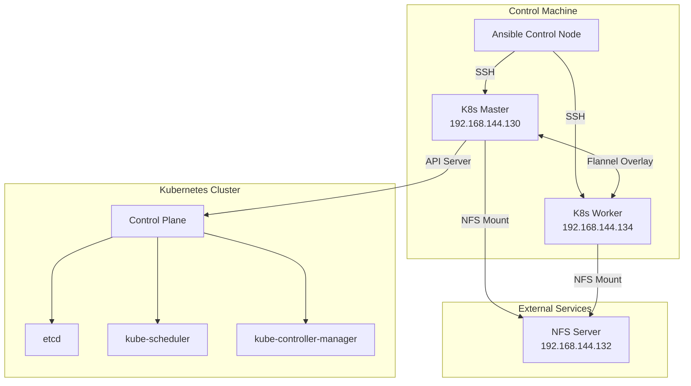

---

## Project Directory Structure

```
📁 Cdac Project/
├── 📄 README.md                          # Quick start guide
├── 📁 ansible/                           # Ansible automation
│   ├── 📁 inventory/
│   │   └── 📄 hosts.ini                  # Cluster node IPs
│   ├── 📁 group_vars/
│   │   └── 📄 all.yml                    # Global configuration variables
│   ├── 📄 site.yml                       # Main playbook (orchestrates all roles)
│   └── 📁 roles/
│       ├── 📁 common/                    # Prerequisites & containerd
│       │   ├── 📁 tasks/main.yml
│       │   └── 📁 handlers/main.yml
│       ├── 📁 k8s_master/                # Control plane setup
│       │   ├── 📁 tasks/main.yml
│       │   └── 📁 handlers/main.yml
│       ├── 📁 k8s_worker/                # Worker node join
│       │   └── 📁 tasks/main.yml
│       └── 📁 security/                  # Firewall & CIS hardening
│           ├── 📁 tasks/main.yml
│           └── 📁 handlers/main.yml
├── 📁 kubernetes/                        # Kubernetes manifests
│   ├── 📁 monitoring/                    # Prometheus + Grafana stack
│   │   ├── 📄 namespace.yaml
│   │   ├── 📄 prometheus.yaml
│   │   ├── 📄 prometheus-alerts.yaml
│   │   ├── 📄 grafana.yaml
│   │   ├── 📄 grafana-dashboards.yaml
│   │   ├── 📄 node-exporter.yaml
│   │   └── 📄 kube-state-metrics.yaml
│   ├── 📁 storage/                       # NFS PersistentVolumes
│   │   ├── 📄 storage-class.yaml
│   │   ├── 📄 nfs-pv.yaml
│   │   └── 📄 nfs-pvc.yaml
│   ├── 📁 nginx/                         # Sample workload
│   │   └── 📄 deployment.yaml
│   ├── 📁 security/                      # Network Policies & RBAC
│   │   ├── 📄 network-policy.yaml
│   │   └── 📄 pss-rbac.yaml
│   └── 📁 falco/                         # Runtime security
│       └── 📄 falco.yaml
├── 📁 scripts/                           # Utility scripts
│   ├── 📄 etcd-backup.sh                 # Automated backup
│   └── 📄 diagnose-services.sh           # Troubleshooting
└── 📁 docs/                              # Documentation
    ├── 📄 Kubernetes_Cluster_Project_Document.md
    ├── 📄 Interview_QA_Guide.md
    └── 📄 setup_guide.md
```

---

## Complete Deployment Flow

The entire deployment is orchestrated by **one single command**:

```bash
cd ansible
ansible-playbook -i inventory/hosts.ini site.yml
```

This triggers a **4-play sequence** that sets up everything:

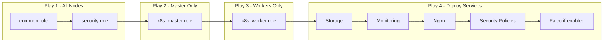

---

## Phase 1: Prerequisites Setup (common role)

**File:** `ansible/roles/common/tasks/main.yml`

This role runs on **ALL nodes** (master + workers) and prepares them for Kubernetes.

### Step-by-Step Execution

| Step | Task | What It Does |
|------|------|--------------|
| 1 | Disable Swap | Kubernetes requires swap to be off |
| 2 | Update apt cache | Refresh package lists |
| 3 | Install packages | `apt-transport-https, curl, nfs-common, etc.` |
| 4 | Load kernel modules | `overlay, br_netfilter` for container networking |
| 5 | Configure sysctl | Enable IP forwarding and bridge filtering |
| 6 | Install containerd | Container runtime |
| 7 | Configure containerd | Enable systemd cgroup driver |
| 8 | Add K8s apt repo | Kubernetes v1.29 packages |
| 9 | Install K8s components | `kubelet, kubeadm, kubectl` |
| 10 | Hold packages | Prevent auto-upgrades |
| 11 | Configure kubelet | Memory/CPU reservations for 8GB setup |
| 12 | Update /etc/hosts | Add hostnames for all cluster nodes |

### Key Configuration Applied

```yaml
# Sysctl parameters for Kubernetes networking
net.bridge.bridge-nf-call-iptables = 1
net.bridge.bridge-nf-call-ip6tables = 1
net.ipv4.ip_forward = 1

# Resource reservations for 8GB RAM
kubelet_system_reserved_memory: "500Mi"
kubelet_system_reserved_cpu: "200m"
```

---

## Phase 2: Security Hardening (security role)

**File:** `ansible/roles/security/tasks/main.yml`

This role implements **CIS Kubernetes Benchmark** controls and firewall rules.

### Firewall Configuration (UFW)

| Port | Protocol | Purpose | Scope |
|------|----------|---------|-------|
| 22 | TCP | SSH access | All nodes |
| 6443 | TCP | Kubernetes API Server | Master only |
| 2379-2380 | TCP | etcd client/peer comms | Master only |
| 10250 | TCP | Kubelet API | All nodes |
| 10251 | TCP | kube-scheduler | Master only |
| 10252 | TCP | kube-controller-manager | Master only |
| 30000-32767 | TCP | NodePort Services | All nodes |
| 8472 | UDP | Flannel VXLAN | All nodes |
| 9100 | TCP | Node Exporter metrics | All nodes |

### SSH Hardening

```yaml
PermitRootLogin no              # Disable root SSH
PasswordAuthentication no        # Key-based auth only
```

### CIS Benchmark Controls Implemented

| CIS ID | Control | Implementation |
|--------|---------|----------------|
| 1.1.1-1.1.21 | Control plane file permissions | chmod 0600 on manifest files |
| 1.1.12 | Secure etcd data | chmod 0700 on /var/lib/etcd |
| 1.1.19-21 | PKI certificate permissions | 0644 for certs, 0600 for keys |
| 4.1.1-5 | Kubelet configuration | Secure file permissions |
| 4.2.1 | Anonymous authentication | Disabled |
| 4.2.4 | Read-only port | Disabled (port 0) |
| 5.2.x | Pod Security Standards | Enforced via namespace labels |
| 5.3.2 | Network Policies | Applied in K8s manifests |

### Kernel Hardening Parameters

```yaml
kernel.randomize_va_space = 2           # ASLR enabled
net.ipv4.conf.all.rp_filter = 1         # Reverse path filtering
net.ipv4.icmp_echo_ignore_broadcasts = 1
net.ipv4.conf.all.accept_source_route = 0
net.ipv4.conf.all.send_redirects = 0
```

---

## Phase 3: Kubernetes Master Initialization (k8s_master role)

**File:** `ansible/roles/k8s_master/tasks/main.yml`

This role runs **only on the master node** and sets up the control plane.

### Step-by-Step Execution

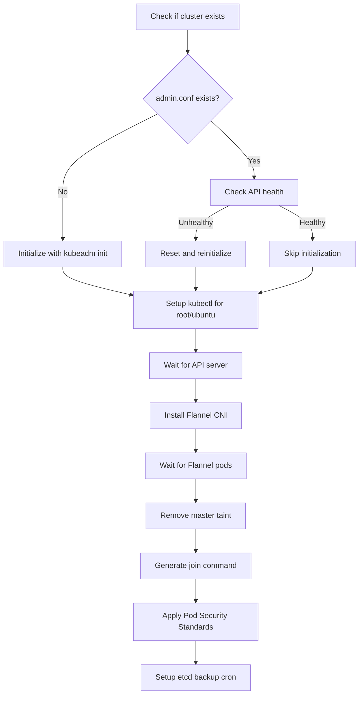

### kubeadm init Command

```bash
kubeadm init \
  --apiserver-advertise-address=192.168.144.130 \
  --pod-network-cidr=10.244.0.0/16 \
  --service-cidr=10.96.0.0/12 \
  --cri-socket=unix:///run/containerd/containerd.sock
```

### Pod Security Standards Applied

```bash
kubectl label namespace default pod-security.kubernetes.io/enforce=baseline --overwrite
kubectl label namespace default pod-security.kubernetes.io/warn=baseline --overwrite
kubectl label namespace default pod-security.kubernetes.io/audit=baseline --overwrite
```

### Master Taint Removal (for 8GB setup)

```bash
# Allows pods to run on master node
kubectl taint nodes --all node-role.kubernetes.io/control-plane:NoSchedule-
```

---

## Phase 4: Worker Node Join (k8s_worker role)

**File:** `ansible/roles/k8s_worker/tasks/main.yml`

This role runs **only on worker nodes** and joins them to the cluster.

### Step-by-Step Execution

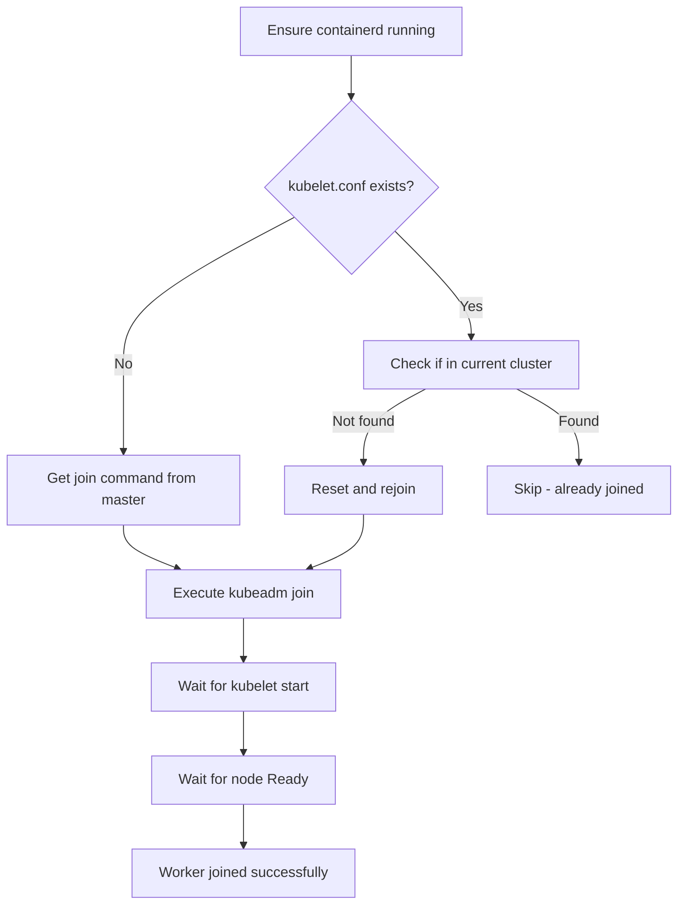

### Join Command Format

```bash
kubeadm join 192.168.144.130:6443 \
  --token <token> \
  --discovery-token-ca-cert-hash sha256:<hash> \
  --cri-socket=unix:///run/containerd/containerd.sock
```

---

## Phase 5: Cluster Services Deployment

**File:** `ansible/site.yml` (Play 4 tasks)

After all nodes are ready, the playbook deploys cluster services.

### Deployment Order

| Order | Component | Namespace | Purpose |
|-------|-----------|-----------|---------|
| 1 | Storage (PVs, PVCs, StorageClass) | N/A (cluster-wide) | NFS persistent storage |
| 2 | Monitoring namespace | `monitoring` | Namespace for observability |
| 3 | Prometheus + Node Exporter + Kube-State-Metrics | `monitoring` | Metrics collection |
| 4 | Grafana + Dashboards | `monitoring` | Visualization |
| 5 | Prometheus Alerts | `monitoring` | Alert rules |
| 6 | Nginx Deployment | `default` | Sample workload |
| 7 | Network Policies + RBAC | `default` | Security policies |
| 8 | Falco (if enabled) | `falco` | Runtime security |

### Manifest Application Flow

```bash
# On master node via Ansible
kubectl apply -f /opt/kubernetes/storage/
kubectl apply -f /opt/kubernetes/monitoring/
kubectl apply -f /opt/kubernetes/nginx/
kubectl apply -f /opt/kubernetes/security/
kubectl apply -f /opt/kubernetes/falco/  # if enable_falco=true
```

---

## Monitoring Stack

### Components

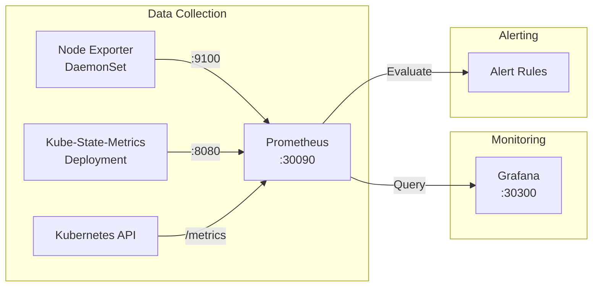

### Prometheus Configuration

**File:** `kubernetes/monitoring/prometheus.yaml`

| Setting | Value | Purpose |
|---------|-------|---------|
| Scrape interval | 30s | Resource optimization |
| Retention time | 2 days | Storage limit |
| Retention size | 500MB | Disk limit |
| Memory limit | 256Mi | 8GB RAM optimization |

### Scrape Targets

| Job Name | Target | Metrics |
|----------|--------|---------|
| `prometheus` | localhost:9090 | Prometheus internal |
| `kubernetes-apiservers` | Kubernetes API | API server health |
| `kubernetes-nodes` | All nodes via proxy | Kubelet metrics |
| `node-exporter` | :9100 on each node | System metrics (CPU, RAM, Disk) |
| `kube-state-metrics` | :8080 | K8s object state |
| `falco` | :8765 | Security events |

### Grafana Dashboards

Pre-configured dashboards in `kubernetes/monitoring/grafana-dashboards.yaml`:
- Cluster Overview
- Node Resource Usage
- Pod Health
- Falco Security Events

---

## Node Exporter (Detailed)

**File:** `kubernetes/monitoring/node-exporter.yaml`

Node Exporter runs as a **DaemonSet** on every node and exports hardware/OS metrics to Prometheus.

### How It Works Step-by-Step

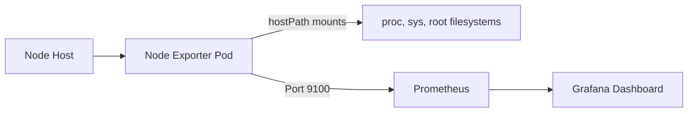

1. **DaemonSet Deployment**: Ensures one pod per node automatically
2. **Host Access**: Uses `hostPID`, `hostIPC`, `hostNetwork` for full system visibility
3. **Volume Mounts**: Mounts `/proc`, `/sys`, `/` to read system metrics
4. **Metrics Exported**: CPU, memory, disk, network statistics
5. **Scrape Configuration**: Prometheus scrapes port 9100 on each node

### Key Configuration

| Setting | Value | Purpose |
|---------|-------|---------|
| hostNetwork | true | Access node's network metrics |
| hostPID | true | Access process information |
| hostPort | 9100 | Expose on node's IP |
| tolerations | NoSchedule, NoExecute | Run on master nodes too |

### Metrics Available

- `node_cpu_seconds_total` - CPU usage
- `node_memory_MemAvailable_bytes` - Available memory
- `node_filesystem_avail_bytes` - Disk space
- `node_network_receive_bytes_total` - Network traffic

---

## Kube-State-Metrics (Detailed)

**File:** `kubernetes/monitoring/kube-state-metrics.yaml`

Kube-State-Metrics generates metrics about the state of Kubernetes objects (pods, deployments, nodes, etc.).

### Why It's Needed

| Without Kube-State-Metrics | With Kube-State-Metrics |
|----------------------------|-------------------------|
| No pod count metrics | `kube_pod_status_phase` |
| No deployment replica info | `kube_deployment_status_replicas` |
| No node condition data | `kube_node_status_condition` |
| Grafana shows "No Data" | Full Kubernetes visibility |

### Components Created

1. **ServiceAccount**: `kube-state-metrics` in monitoring namespace
2. **ClusterRole**: Read-only access to all K8s resources
3. **ClusterRoleBinding**: Binds role to service account
4. **Deployment**: Single replica with health probes
5. **Service**: ClusterIP on ports 8080 (metrics) and 8081 (telemetry)

### RBAC Permissions (What It Can Read)

```yaml
- Core: pods, nodes, services, secrets, configmaps, PVs, PVCs, namespaces
- Apps: deployments, daemonsets, replicasets, statefulsets
- Batch: jobs, cronjobs
- Networking: ingresses
- Storage: storageclasses, volumeattachments
```

### Key Metrics

| Metric | Description |
|--------|-------------|
| `kube_pod_status_phase{phase="Running"}` | Running pods count |
| `kube_deployment_status_available_replicas` | Available replicas |
| `kube_node_status_condition{condition="Ready"}` | Node health |
| `kube_pod_container_status_restarts_total` | Container restarts |

---

## Prometheus Alerting Rules (Detailed)

**File:** `kubernetes/monitoring/prometheus-alerts.yaml`

Pre-configured alerting rules for proactive monitoring.

### Alert Categories

#### 1. Node Alerts

| Alert | Condition | Severity | For Duration |
|-------|-----------|----------|--------------|
| **NodeDown** | `up{job="node-exporter"} == 0` | Critical | 2 min |
| **HighCPUUsage** | CPU > 80% | Warning | 5 min |
| **HighMemoryUsage** | Memory > 85% | Warning | 5 min |
| **DiskSpaceLow** | Disk < 15% | Warning | 5 min |
| **DiskSpaceCritical** | Disk < 5% | Critical | 2 min |

#### 2. Kubernetes Alerts

| Alert | Condition | Severity | For Duration |
|-------|-----------|----------|--------------|
| **KubernetesNodeNotReady** | Node not Ready | Critical | 5 min |
| **PodCrashLooping** | Restarts > 0.5/min | Warning | 5 min |
| **PodNotReady** | Pod not Ready | Warning | 10 min |
| **DeploymentReplicasMismatch** | Actual ≠ Desired replicas | Warning | 10 min |

#### 3. Application Alerts

| Alert | Condition | Severity | For Duration |
|-------|-----------|----------|--------------|
| **NginxDown** | Nginx unreachable | Critical | 2 min |
| **HighNginxLatency** | 95th percentile > 2s | Warning | 5 min |

#### 4. Backup Alerts

| Alert | Condition | Severity | For Duration |
|-------|-----------|----------|--------------|
| **EtcdBackupMissing** | No backup in 2 hours | Critical | 5 min |

### How Alerts Work

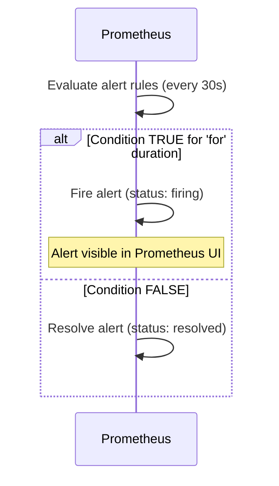

---

## Storage Configuration

### PersistentVolumeClaims (Detailed)

**File:** `kubernetes/storage/nfs-pvc.yaml`

PVCs request storage from the cluster. They bind to matching PVs.

| PVC Name | Namespace | Storage | Bound To PV |
|----------|-----------|---------|-------------|
| nfs-pvc | default | 5Gi | nfs-kubernetes-pv |
| prometheus-pvc | monitoring | 5Gi | nfs-prometheus-pv |
| grafana-pvc | monitoring | 2Gi | nfs-grafana-pv |
| nginx-pvc | default | 1Gi | nfs-nginx-pv |

### PV-PVC Binding Flow

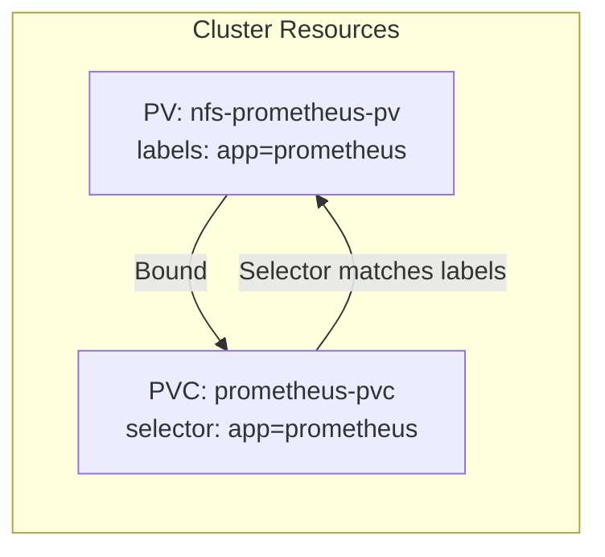

---

## RBAC Configuration (Detailed)

**File:** `kubernetes/security/pss-rbac.yaml`

### Pod Security Standards Enforcement

The `default` namespace has these labels applied:

```yaml
pod-security.kubernetes.io/enforce: baseline      # Block non-compliant pods
pod-security.kubernetes.io/warn: restricted       # Warn about restricted violations
pod-security.kubernetes.io/audit: restricted      # Log restricted violations
```

### Sample RBAC Role: pod-reader

| Permission | Resources | Verbs |
|------------|-----------|-------|
| Read pods | pods, pods/log | get, list, watch |
| Read services | services | get, list |

### RoleBinding

```yaml
Subject: User "developer"
Role: pod-reader
Namespace: default
```

This demonstrates least-privilege access - developers can view pods but cannot modify them.

---

## Nginx Sample Workload (Detailed)

**File:** `kubernetes/nginx/deployment.yaml`

### Self-Healing Features

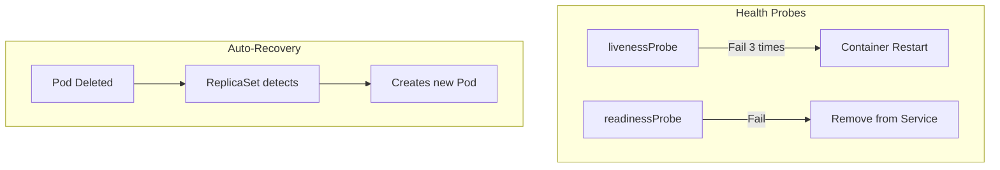

### Probe Configuration

| Probe | Path | Port | Initial Delay | Period | Failure Threshold |
|-------|------|------|---------------|--------|-------------------|
| livenessProbe | / | 8080 | 10s | 5s | 3 |
| readinessProbe | / | 8080 | 5s | 3s | Default |

### Security Context (PSS Compliant)

```yaml
Pod-level:
  runAsNonRoot: true
  runAsUser: 101 (nginx user)
  seccompProfile: RuntimeDefault

Container-level:
  allowPrivilegeEscalation: false
  capabilities: drop ALL
```

### Rolling Update Strategy

```yaml
strategy:
  type: RollingUpdate
  maxSurge: 1          # One extra pod during update
  maxUnavailable: 0    # Zero downtime
```

---

### NFS Architecture

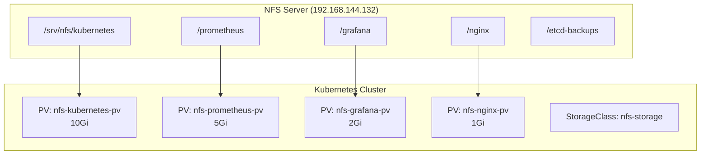

### PersistentVolume Configuration

**File:** `kubernetes/storage/nfs-pv.yaml`

| PV Name | Capacity | Access Mode | NFS Path |
|---------|----------|-------------|----------|
| nfs-kubernetes-pv | 10Gi | ReadWriteMany | /srv/nfs/kubernetes |
| nfs-prometheus-pv | 5Gi | ReadWriteMany | /srv/nfs/kubernetes/prometheus |
| nfs-grafana-pv | 2Gi | ReadWriteMany | /srv/nfs/kubernetes/grafana |
| nfs-nginx-pv | 1Gi | ReadWriteMany | /srv/nfs/kubernetes/nginx |

---

## Security Implementation

### Multi-Layer Security Model

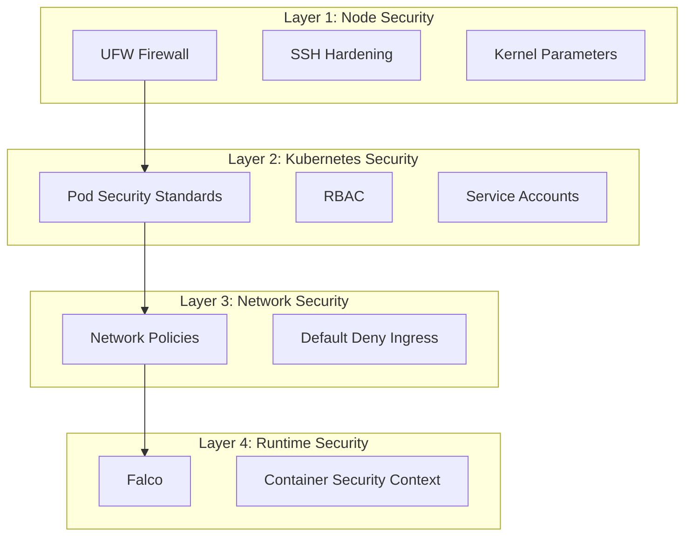

### Network Policies

**File:** `kubernetes/security/network-policy.yaml`

| Policy | Target | Rule |
|--------|--------|------|
| default-deny-ingress | All pods in default | Block all incoming traffic |
| allow-nginx-ingress | nginx pods | Allow traffic on port 8080 |
| allow-prometheus-scrape | All pods | Allow from monitoring namespace |

### Pod Security Standards (PSS)

The project uses **baseline** PSS level:

```yaml
# Applied to default namespace
pod-security.kubernetes.io/enforce: baseline
pod-security.kubernetes.io/warn: baseline
pod-security.kubernetes.io/audit: baseline
```

---

## Runtime Security with Falco

**File:** `kubernetes/falco/falco.yaml`

Falco provides real-time threat detection by monitoring system calls.

### Deployment Type

- **DaemonSet**: Runs on every node
- **Privileged mode**: Required for syscall monitoring
- **Host network/PID**: Full visibility into host activities

### Detection Rules

| Rule | Priority | Detection |
|------|----------|-----------|
| Shell Spawned in Container | WARNING | bash/sh/zsh execution in containers |
| Sensitive File Access | CRITICAL | Reading /etc/shadow, /etc/passwd, admin.conf |
| Kubectl Exec Detected | NOTICE | Interactive shell via kubectl exec |

### Integration with Prometheus

```yaml
webserver:
  enabled: true
  listen_port: 8765  # Scraped by Prometheus
metrics:
  enabled: true
  interval: 30s
```

---

## Backup and Diagnostics

### etcd Backup Script

**File:** `scripts/etcd-backup.sh`

Automated hourly backup of cluster state:

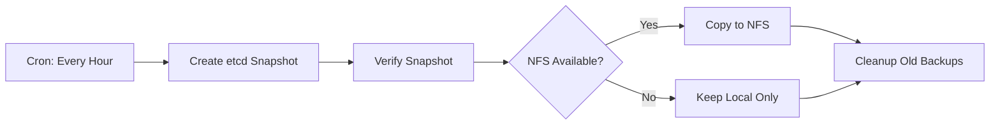

**Retention Policy:**
- Local: 24 hourly backups
- NFS: 7 daily backups

### Diagnostic Script

**File:** `scripts/diagnose-services.sh`

Run on master to troubleshoot issues:

```bash
./diagnose-services.sh
```

**Checks performed:**
1. Cluster connectivity
2. Node status
3. Namespace existence
4. PV/PVC binding status
5. Deployment status
6. Pod health
7. Service endpoints
8. Firewall rules
9. NFS connectivity

---

## Service Access

After deployment, access services via NodePort:

| Service | URL | Credentials | Port Mapping |
|---------|-----|-------------|--------------|
| **Prometheus** | http://192.168.144.130:30090 | N/A | 30090 → 9090 |
| **Grafana** | http://192.168.144.130:30300 | admin / admin | 30300 → 3000 |
| **Nginx** | http://192.168.144.130:30080 | N/A | 30080 → 8080 |

### Verification Commands

```bash
# Check cluster status
kubectl get nodes -o wide

# Check all pods
kubectl get pods --all-namespaces

# Test self-healing (delete a pod, watch it recreate)
kubectl delete pod <nginx-pod-name>
kubectl get pods -w

# View Prometheus targets
curl http://192.168.144.130:30090/targets

# Check Falco logs
kubectl logs -n falco -l app=falco
```

---

## Data Flow Diagram

### Complete System Flow

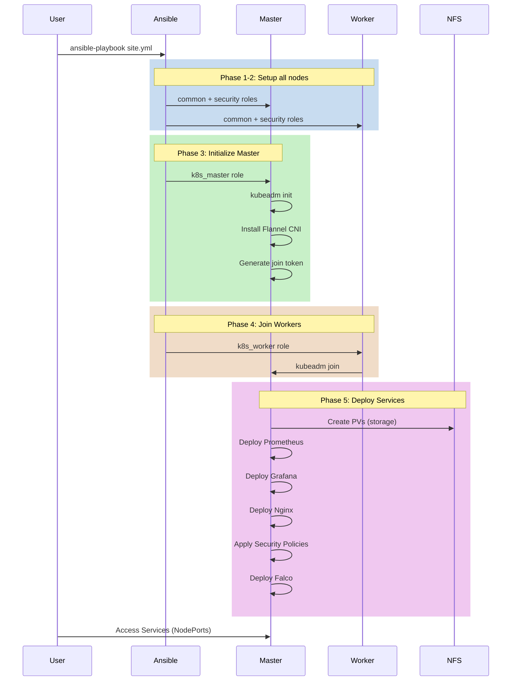

---

## Quick Reference

### Configuration Variables (group_vars/all.yml)

| Variable | Default | Purpose |
|----------|---------|---------|
| `api_server_advertise_address` | 192.168.144.130 | Master IP |
| `nfs_server` | 192.168.144.132 | NFS server IP |
| `kubernetes_version` | 1.29 | K8s version |
| `cni_plugin` | flannel | Network plugin |
| `enable_falco` | true | Runtime security |
| `pss_level` | baseline | Pod Security Standard |
| `allow_master_scheduling` | true | Run pods on master |

### Resource Limits (Optimized for 8GB RAM)

| Component | Memory Request | Memory Limit |
|-----------|----------------|--------------|
| Prometheus | 128Mi | 256Mi |
| Grafana | 64Mi | 128Mi |
| Nginx (per pod) | 32Mi | 64Mi |
| Falco | 128Mi | 256Mi |

---

## Summary

This project provides a **complete, automated solution** for deploying a Kubernetes cluster with:

1. **One-command deployment** via Ansible
2. **Comprehensive monitoring** with Prometheus and Grafana
3. **Multi-layer security** from firewall to runtime protection
4. **Self-healing workloads** with liveness/readiness probes
5. **Persistent storage** via NFS integration
6. **Automated backups** of cluster state
7. **Built-in diagnostics** for troubleshooting

The entire setup is **optimized for resource-constrained environments** (8GB RAM, 2 nodes) while maintaining production-grade security and observability.
