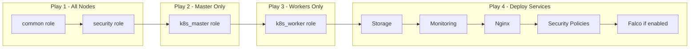

# 🔧 Complete Project Explanation — Technical Guide

> **Purpose**: This document explains every component of the project — **why** it's used, **how** it works, **what commands** are involved, and **real examples** from the actual project files.

---

## 📋 Table of Contents

1. [Project Overview](#1-project-overview)
2. [Ansible Automation](#2-ansible-automation)
3. [Container Runtime — containerd](#3-container-runtime--containerd)
4. [Kubernetes Cluster (kubeadm)](#4-kubernetes-cluster-kubeadm)
5. [CNI Networking — Flannel](#5-cni-networking--flannel)
6. [NFS Storage (PV, PVC, StorageClass)](#6-nfs-storage-pv-pvc-storageclass)
7. [Monitoring Stack (Prometheus + Grafana)](#7-monitoring-stack-prometheus--grafana)
8. [Metrics Exporters (Node Exporter + KSM)](#8-metrics-exporters-node-exporter--ksm)
9. [Nginx Application](#9-nginx-application)
10. [Autoscaling (HPA + Metrics Server)](#10-autoscaling-hpa--metrics-server)
11. [Security — RBAC](#11-security--rbac)
12. [Security — Pod Security Standards](#12-security--pod-security-standards)
13. [Security — Network Policies](#13-security--network-policies)
14. [Security — Grafana Secrets](#14-security--grafana-secrets)
15. [Security — Falco Runtime](#15-security--falco-runtime)
16. [Backup & Diagnostics](#16-backup--diagnostics)
17. [Complete Command Reference](#17-complete-command-reference)

---

## 1. Project Overview

### What is this project?
This project **automates the deployment of a production-ready Kubernetes cluster** using Ansible. Instead of running 50+ commands manually on each server, you run **one command** and get a complete cluster with monitoring, security, storage, and autoscaling — all configured.

### What does the final cluster look like?

```
┌─────────────────────────────────────────────────────────────────┐
│                     YOUR KUBERNETES CLUSTER                      │
│                                                                  │
│  MASTER NODE (192.168.144.130)    WORKER NODE (192.168.144.134) │
│  ┌──────────────────────┐         ┌──────────────────────┐      │
│  │ API Server           │         │ kubelet              │      │
│  │ etcd (cluster DB)    │◄═══════►│ kube-proxy           │      │
│  │ Scheduler            │ Flannel │ containerd           │      │
│  │ Controller Manager   │  CNI    │                      │      │
│  └──────────────────────┘         └──────────────────────┘      │
│                                                                  │
│  RUNNING PODS (on both nodes):                                   │
│  ┌────────────┐ ┌────────────┐ ┌──────────┐ ┌──────────┐       │
│  │ Prometheus │ │ Grafana    │ │ Nginx x2 │ │ Falco    │       │
│  │ :30090     │ │ :30300     │ │ :30080   │ │ security │       │
│  └─────┬──────┘ └─────┬──────┘ └────┬─────┘ └──────────┘       │
│        │              │             │                            │
│        └──────────────┴─────────────┘                            │
│                       │ NFS (PVC)                                │
│                       ▼                                          │
│          NFS SERVER (192.168.144.132)                             │
│          /srv/nfs/kubernetes/                                     │
└─────────────────────────────────────────────────────────────────┘
```

### How to deploy the entire cluster:
```bash
cd ansible
ansible-playbook -i inventory/hosts.ini site.yml
```

This triggers a **4-play sequence** that sets up everything:


```mermaid
flowchart LR
    subgraph "Play 1 - All Nodes"
        A1[common role] --> A2[security role]
    end
    
    subgraph "Play 2 - Master Only"
        B1[k8s_master role]
    end
    
    subgraph "Play 3 - Workers Only"
        C1[k8s_worker role]
    end
    
    subgraph "Play 4 - Deploy Services"
        D1[Storage] --> D2[Monitoring]
        D2 --> D3[Nginx]
        D3 --> D4[Security Policies]
        D4 --> D5[Falco if enabled]
    end
    
    A2 --> B1
    B1 --> C1
    C1 --> D1
```

That's it. One command. ~15 minutes. The rest of this document explains what happens behind the scenes.

### Project Directory Structure

```text
📁 Cdac Project/
├── 📄 README.md                          # Quick start guide
├── 📁 ansible/                           # Ansible automation
│   ├── 📁 inventory/
│   │   └── 📄 hosts.ini                  # Cluster node IPs
│   ├── 📁 group_vars/
│   │   └── 📄 all.yml                    # Global configuration variables
│   ├── 📄 site.yml                       # Main playbook (orchestrates all roles)
│   └── 📁 roles/
│       ├── 📁 common/                    # Prerequisites & containerd
│       ├── 📁 k8s_master/                # Control plane setup
│       ├── 📁 k8s_worker/                # Worker node join
│       └── 📁 security/                  # Firewall & CIS hardening
├── 📁 kubernetes/                        # Kubernetes manifests
│   ├── 📁 monitoring/                    # Prometheus + Grafana stack
│   ├── 📄 node-exporter.yaml
│   ├── 📄 kube-state-metrics.yaml
│   ├── 📁 storage/                       # NFS PersistentVolumes
│   ├── 📁 nginx/                         # Sample workload
│   ├── 📁 security/                      # Network Policies & RBAC
│   ├── 📁 autoscaling/                   # HPA + metrics-server
│   └── 📁 falco/                         # Runtime security
├── 📁 scripts/                           # Utility scripts
│   ├── 📄 etcd-backup.sh                 # Automated backup
│   └── 📄 diagnose-services.sh           # Troubleshooting
└── 📁 docs/                              # Documentation
    ├── 📄 Project_Explanation.md         # Full project technical guide
    ├── 📄 Interview_Complete_Guide.md    # Comprehensive interview guide
    └── 📄 setup_guide.md                 # Initial setup instructions
```

---

## 2. Ansible Automation

### WHY Ansible?
| Problem Without Ansible | Solution With Ansible |
|---|---|
| Manually SSH into each server | Ansible connects via SSH automatically |
| Run 50+ commands per node | One playbook runs everything |
| Human errors (typos, missed steps) | Idempotent — same result every run |
| No record of what was done | YAML files = documentation |
| Knowledge lost when engineer leaves | Playbooks = knowledge in code |

### HOW it works:
Ansible reads a **playbook** (`site.yml`) that tells it:
1. **Which servers** to connect to → `inventory/hosts.ini`
2. **What variables** to use → `group_vars/all.yml`
3. **What tasks** to run → roles (`common`, `security`, `k8s_master`, `k8s_worker`)

```
site.yml (playbook)
    │
    ├── Play 1: ALL NODES → common role + security role
    │   ├── Install containerd
    │   ├── Install kubelet, kubeadm, kubectl
    │   ├── Configure firewall (UFW)
    │   └── SSH hardening
    │
    ├── Play 2: MASTER ONLY → k8s_master role
    │   ├── kubeadm init (create cluster)
    │   ├── Install Flannel CNI
    │   ├── Remove master taint (allow pods on master)
    │   └── Generate join token for workers
    │
    ├── Play 3: WORKERS ONLY → k8s_worker role
    │   └── kubeadm join (join the cluster)
    │
    └── Play 4: DEPLOY SERVICES (on master)
        ├── Apply storage manifests (PV, PVC)
        ├── Apply grafana-secret
        ├── Apply monitoring (Prometheus, Grafana)
        ├── Apply nginx
        ├── Deploy metrics-server
        ├── Apply HPA (autoscaling)
        ├── Apply security (RBAC, NetworkPolicy)
        └── Apply Falco (if enabled)
```

### Key Files:

#### `ansible/inventory/hosts.ini` — Tells Ansible WHERE to connect
```ini
[masters]
k8s-master ansible_host=192.168.144.130   # Master node IP

[workers]
k8s-worker1 ansible_host=192.168.144.134  # Worker node IP

[all:vars]
ansible_user=ubuntu                        # SSH username
ansible_ssh_private_key_file=~/.ssh/id_rsa # SSH key (no passwords)
```

#### `ansible/group_vars/all.yml` — All configurable settings
```yaml
kubernetes_version: "1.35"                 # Which K8s version to install
api_server_advertise_address: "192.168.144.130"  # Master IP
nfs_server: "192.168.144.132"              # NFS storage server IP
cni_plugin: "flannel"                      # Network plugin (flannel = lightweight)
enable_falco: true                         # Enable runtime security
pss_level: "baseline"                      # Pod Security level
prometheus_memory_limit: "512Mi"           # Prometheus RAM cap
grafana_admin_password: "K8sGrafana@2024!" # Grafana login password
```

### Commands:

| Command | What It Does |
|---|---|
| `ansible-playbook -i inventory/hosts.ini site.yml` | **Deploy everything** (the main command) |
| `ansible -i inventory/hosts.ini all -m ping` | Test if Ansible can reach all servers |
| `ansible-playbook site.yml --check` | Dry run — shows what WOULD change |
| `ansible-playbook site.yml -vvv` | Verbose output — see every step |
| `ansible-playbook site.yml --tags common` | Run only the `common` role |

### Example Output:
```
PLAY [Setup prerequisites on all nodes] ****
TASK [common : Disable swap] ************** 
changed: [k8s-master]
changed: [k8s-worker1]

TASK [common : Install containerd] ********
ok: [k8s-master]        ← Already installed (idempotent!)
changed: [k8s-worker1]  ← Installed fresh

PLAY RECAP ********************************
k8s-master   : ok=42  changed=3   failed=0
k8s-worker1  : ok=42  changed=15  failed=0
```

---

## 3. Container Runtime — containerd

### WHY containerd?
| Question | Answer |
|---|---|
| What is a container runtime? | Software that actually **runs containers** on a machine |
| Why not Docker? | Kubernetes **removed Docker support** in v1.24. containerd is Docker's engine without the extras |
| Why containerd specifically? | It's the **official CRI** (Container Runtime Interface), lighter (~50MB), used by AWS/GCP/Azure |

### HOW it works:
```
kubectl create pod → API Server → Scheduler → kubelet → containerd → Linux kernel
                                                          │
                                                          ├── Creates namespaces (isolation)
                                                          ├── Creates cgroups (resource limits)
                                                          └── Runs the container process
```

### Key Configuration (from `common` role):
```yaml
# Generate default config
containerd config default > /etc/containerd/config.toml

# Critical setting: Use systemd cgroup driver
# WHY: kubelet uses systemd, containerd must match
SystemdCgroup = true
```

### Commands:
```bash
# Check if containerd is running
systemctl status containerd

# List running containers (on any node)
crictl ps

# Pull an image manually
crictl pull nginx:1.25.3-alpine

# Check containerd version
containerd --version
```

---

## 4. Kubernetes Cluster (kubeadm)

### WHY kubeadm?
| Option | Pros | Cons | Why We Chose |
|---|---|---|---|
| **kubeadm** | Standard, works anywhere, full control | Manual setup | ✅ Portable, no vendor lock-in |
| EKS/GKE/AKS | Managed, easy | Vendor lock-in, costs money | ❌ Not portable |
| k3s | Lightweight | Non-standard, limited features | ❌ Missing features |

### HOW the cluster initializes:

#### Step 1: Master node runs `kubeadm init`
```bash
kubeadm init \
  --apiserver-advertise-address=192.168.144.130 \    # Where API listens
  --pod-network-cidr=10.244.0.0/16 \                 # Pod IP range (must match Flannel)
  --service-cidr=10.96.0.0/12 \                      # Service IP range
  --cri-socket=unix:///run/containerd/containerd.sock # Use containerd
```

**What this creates on the master:**
| Component | Port | Purpose |
|---|---|---|
| API Server | 6443 | Entry point for all cluster operations |
| etcd | 2379-2380 | Database storing ALL cluster state |
| Scheduler | 10251 | Decides which node runs each pod |
| Controller Manager | 10252 | Ensures actual state = desired state |

#### Step 2: Setup kubectl (so you can talk to the cluster)
```bash
mkdir -p $HOME/.kube
cp /etc/kubernetes/admin.conf $HOME/.kube/config
```

#### Step 3: Worker joins the cluster
```bash
kubeadm join 192.168.144.130:6443 \
  --token <token> \
  --discovery-token-ca-cert-hash sha256:<hash>
```

#### Step 4: Remove master taint (for our 8GB setup)
```bash
# By default, master won't run your pods (only system pods)
# We remove this restriction because we only have 2 nodes
kubectl taint nodes --all node-role.kubernetes.io/control-plane:NoSchedule-
```

### Commands:
```bash
# Check cluster health
kubectl cluster-info
kubectl get nodes -o wide

# Check all system pods
kubectl get pods -n kube-system

# Check component status
kubectl get componentstatuses

# Generate a new join token (if old one expired after 24h)
kubeadm token create --print-join-command
```

### Example Output:
```bash
$ kubectl get nodes -o wide
NAME          STATUS   ROLES           AGE   VERSION   INTERNAL-IP
k8s-master    Ready    control-plane   10m   v1.35.x   192.168.144.130
k8s-worker1   Ready    <none>          8m    v1.35.x   192.168.144.134
```

---

## 5. CNI Networking — Flannel

### WHY Flannel?
| Question | Answer |
|---|---|
| What is CNI? | Container Network Interface — lets pods on different nodes talk to each other |
| Why pods need a CNI? | Without it, pods can only talk to pods on the SAME node |
| Why Flannel over Calico? | Flannel uses ~50MB RAM vs Calico's ~200MB. In 8GB setup, every MB matters |
| Tradeoff? | Flannel doesn't provide Network Policies natively, but Kubernetes handles them anyway |

### HOW it works:
```
Pod A (Node 1: 10.244.0.5)          Pod B (Node 2: 10.244.1.3)
        │                                    ▲
        ▼                                    │
   flannel.1 (VXLAN tunnel)  ═══════>   flannel.1 (VXLAN tunnel)
        │                                    │
   eth0 (192.168.144.130)    ────────>  eth0 (192.168.144.134)
```

Flannel creates a **VXLAN overlay network** — it wraps pod traffic inside regular network packets so pods on different physical nodes can communicate.

### Installation (done by Ansible):
```bash
kubectl apply -f https://github.com/flannel-io/flannel/releases/latest/download/kube-flannel.yml
```

### Commands:
```bash
# Check Flannel pods are running
kubectl get pods -n kube-flannel

# Check pod CIDR allocation
kubectl get nodes -o jsonpath='{.items[*].spec.podCIDR}'
# Output: 10.244.0.0/24  10.244.1.0/24

# Check Flannel interface on a node
ip addr show flannel.1
```

---

## 6. NFS Storage (PV, PVC, StorageClass)

### WHY NFS?
| Question | Answer |
|---|---|
| Why do pods need persistent storage? | Without it, data is **lost** when a pod restarts |
| Why NFS? | Supports `ReadWriteMany` — multiple pods can write simultaneously |
| Why not hostPath? | hostPath ties data to one node. If pod moves to another node, data is lost |
| Why a separate NFS server? | Keeps data safe even if the entire Kubernetes cluster dies |

### HOW the storage chain works:
```
NFS Server                     Kubernetes Cluster                Pod
┌─────────────┐    ┌──────────────────────────────────┐    ┌──────────┐
│ /srv/nfs/    │    │                                  │    │          │
│ kubernetes/  │◄───│ PV (points to NFS path)          │◄───│ Volume   │
│ prometheus/  │    │   ↕                              │    │ Mount    │
│              │    │ PVC (requests storage from PV)   │    │          │
│              │    │   ↕                              │    │          │
│              │    │ StorageClass (groups PVs by type) │    │          │
└─────────────┘    └──────────────────────────────────┘    └──────────┘
```

### The 3 Kubernetes objects explained:

#### 1. StorageClass — "What TYPE of storage is available?"
**File**: `kubernetes/storage/storage-class.yaml`
```yaml
apiVersion: storage.k8s.io/v1
kind: StorageClass
metadata:
  name: nfs-storage           # Name other objects reference
provisioner: kubernetes.io/no-provisioner  # Manual provisioning
volumeBindingMode: Immediate   # Bind PVC to PV right away
reclaimPolicy: Retain          # Don't delete data when PVC is removed
```
**WHY `Immediate`?** NFS supports ReadWriteMany, so PVC can bind immediately without waiting for a pod.

#### 2. PersistentVolume (PV) — "Here is ACTUAL storage"
**File**: `kubernetes/storage/nfs-pv.yaml`
```yaml
apiVersion: v1
kind: PersistentVolume
metadata:
  name: nfs-prometheus-pv
  labels:
    app: prometheus          # Label that PVC will match
spec:
  capacity:
    storage: 5Gi             # How much space
  accessModes:
    - ReadWriteMany          # Multiple pods can read/write
  storageClassName: nfs-storage
  nfs:
    server: 192.168.144.132  # NFS server IP
    path: /srv/nfs/kubernetes/prometheus  # Directory on NFS
```

#### 3. PersistentVolumeClaim (PVC) — "I NEED storage"
**File**: `kubernetes/storage/nfs-pvc.yaml`
```yaml
apiVersion: v1
kind: PersistentVolumeClaim
metadata:
  name: prometheus-pvc
  namespace: monitoring
spec:
  storageClassName: nfs-storage
  accessModes:
    - ReadWriteMany
  resources:
    requests:
      storage: 5Gi
  selector:
    matchLabels:
      app: prometheus        # Must match PV label!
```

### All PV/PVC pairs in this project:

| PV Name | Size | PVC Name | Used By | NFS Path |
|---|---|---|---|---|
| `nfs-kubernetes-pv` | 10Gi | `nfs-pvc` | General data | `/srv/nfs/kubernetes` |
| `nfs-prometheus-pv` | 5Gi | `prometheus-pvc` | Prometheus metrics | `/srv/nfs/kubernetes/prometheus` |
| `nfs-grafana-pv` | 2Gi | `grafana-pvc` | Grafana config | `/srv/nfs/kubernetes/grafana` |
| `nfs-nginx-pv` | 1Gi | `nginx-pvc` | Nginx web content | `/srv/nfs/kubernetes/nginx` |

### Commands:
```bash
# Check PVs and their status
kubectl get pv
# Expected: STATUS = Available (unbound) or Bound

# Check PVCs and binding
kubectl get pvc --all-namespaces
# Expected: STATUS = Bound (linked to a PV)

# Verify NFS mount from a node
showmount -e 192.168.144.132
# Output: /srv/nfs/kubernetes  *

# Test NFS connectivity
ping -c 1 192.168.144.132
```

### Example Output:
```
$ kubectl get pv
NAME                 CAPACITY   ACCESS MODES   STATUS   CLAIM
nfs-prometheus-pv    5Gi        RWX            Bound    monitoring/prometheus-pvc
nfs-grafana-pv       2Gi        RWX            Bound    monitoring/grafana-pvc
nfs-nginx-pv         1Gi        RWX            Bound    default/nginx-pvc
```

---

## 7. Monitoring Stack (Prometheus + Grafana)

### WHY Prometheus?
| Question | Answer |
|---|---|
| Why do we need monitoring? | Without it, you're blind — you don't know if things are healthy until users complain |
| Why Prometheus specifically? | It's the **industry standard** for Kubernetes. Pull-based, powerful query language (PromQL), cloud-native |
| What does it collect? | CPU, memory, disk, network, pod status, API server health, Falco security events |
| How does it collect? | **Scrapes** HTTP endpoints every 30 seconds |

### HOW Prometheus works:
```
Every 30 seconds:

    Node Exporter (:9100)     ─── GET /metrics ──→  PROMETHEUS (:9090)
    KSM (:8080)               ─── GET /metrics ──→  (stores in time-series DB)
    Kubernetes API (:6443)    ─── GET /metrics ──→      │
    Falco (:8765)             ─── GET /metrics ──→      │
                                                         │
                                     ┌───────────────────┘
                                     ▼
                              GRAFANA (:3000)
                              "Show me CPU for last 1h"
                              → Queries Prometheus via PromQL
                              → Displays graphs/gauges
```

### Key Configuration:
**File**: `kubernetes/monitoring/prometheus.yaml`
```yaml
# ConfigMap contains prometheus.yml config
global:
  scrape_interval: 30s     # How often to collect metrics
  evaluation_interval: 30s # How often to check alert rules

# What to scrape:
scrape_configs:
  - job_name: 'prometheus'            # Scrape itself
    static_configs:
      - targets: ['localhost:9090']
  
  - job_name: 'node-exporter'         # Scrape node metrics
    kubernetes_sd_configs:             # Auto-discover nodes
      - role: node
    relabel_configs:
      - target_label: __address__
        replacement: ${1}:9100        # Connect on port 9100

  - job_name: 'kube-state-metrics'    # Scrape K8s object state
    static_configs:
      - targets: ['kube-state-metrics:8080']
```

**Prometheus resource settings:**
```yaml
args:
  - '--storage.tsdb.retention.time=3d'   # Keep data for 3 days
  - '--storage.tsdb.retention.size=1GB'  # Max 1GB disk usage
resources:
  limits:
    memory: "512Mi"  # Max RAM for Prometheus
```

### WHY Grafana?
| Question | Answer |
|---|---|
| Can't Prometheus show graphs? | It can, but they're basic. Grafana provides **beautiful dashboards** |
| What dashboards are pre-built? | Cluster Overview, Node Metrics, Pod Resources, Falco Security |
| How does it connect? | Datasource points to `http://prometheus:9090` |

### Grafana credentials:
**File**: `kubernetes/monitoring/grafana-secret.yaml`
```yaml
apiVersion: v1
kind: Secret
metadata:
  name: grafana-credentials
  namespace: monitoring
type: Opaque
stringData:
  admin-user: admin
  admin-password: K8sGrafana@2024!
```
**WHY a Secret?** Never hardcode passwords in deployment files. K8s Secrets are base64-encoded and can be managed centrally.

### Commands:
```bash
# Check monitoring pods
kubectl get pods -n monitoring

# Check Prometheus targets (what it's scraping)
curl http://192.168.144.130:30090/targets

# Check active alerts
curl http://192.168.144.130:30090/api/v1/alerts

# Access in browser
# Prometheus: http://<master-ip>:30090
# Grafana:    http://<master-ip>:30300  (admin / K8sGrafana@2024!)

# Example PromQL query — average CPU usage
# In Prometheus UI: 100 - (avg(rate(node_cpu_seconds_total{mode="idle"}[5m])) * 100)
```

---

## 8. Metrics Exporters (Node Exporter + KSM)

### WHY Node Exporter?
| Question | Answer |
|---|---|
| What does it do? | Reads CPU/RAM/disk/network from the **Linux kernel** and exposes as Prometheus metrics |
| Why needed? | Prometheus can't read kernel data directly. Node Exporter translates it |
| How is it deployed? | **DaemonSet** — automatically runs one pod on every node |

### HOW Node Exporter works:
```
Linux Kernel (/proc, /sys)          Node Exporter Pod          Prometheus
┌─────────────────────┐    reads    ┌──────────────┐   scrapes  ┌──────────┐
│ /proc/stat (CPU)    │───────────→ │ Converts to  │──────────→ │ Stores   │
│ /proc/meminfo (RAM) │            │ Prometheus   │           │ metrics  │
│ /sys/class/net      │            │ format on    │           │ as time- │
│ /proc/diskstats     │            │ port :9100   │           │ series   │
└─────────────────────┘            └──────────────┘           └──────────┘
```

**Key metrics exposed:**
| Metric | What It Measures | Example |
|---|---|---|
| `node_cpu_seconds_total` | CPU time per core | "Core 0 spent 3600s in idle mode" |
| `node_memory_MemAvailable_bytes` | Available RAM | "2.5 GB free" |
| `node_filesystem_avail_bytes` | Free disk space | "15 GB available on /dev/sda1" |
| `node_network_receive_bytes_total` | Network traffic in | "500 MB received on eth0" |

### WHY Kube-State-Metrics (KSM)?
| Question | Answer |
|---|---|
| How is KSM different from Node Exporter? | Node Exporter = **hardware** metrics. KSM = **Kubernetes object** metrics |
| Without KSM? | Grafana shows "No Data" for pod counts, deployment status, node conditions |
| What does it read? | Kubernetes API — pods, deployments, services, nodes, PVCs |

**Key KSM metrics:**
| Metric | What It Tells You |
|---|---|
| `kube_pod_status_phase{phase="Running"}` | How many pods are running |
| `kube_deployment_status_replicas_available` | Are all deployment replicas up? |
| `kube_node_status_condition{condition="Ready"}` | Is the node healthy? |
| `kube_pod_container_status_restarts_total` | Is a pod crash-looping? |

### Commands:
```bash
# Check Node Exporter is running on all nodes
kubectl get pods -n monitoring -l app=node-exporter -o wide

# Manually scrape Node Exporter metrics
curl http://<node-ip>:9100/metrics | head -20

# Check KSM is running
kubectl get pods -n monitoring -l app=kube-state-metrics

# Query a specific KSM metric
curl http://kube-state-metrics:8080/metrics | grep kube_pod_status_phase
```

---

## 9. Nginx Application

### WHY Nginx?
It's the **sample workload** that demonstrates Kubernetes features: self-healing, rolling updates, persistent storage, autoscaling, and PSS compliance.

### HOW the Nginx Deployment works:

**File**: `kubernetes/nginx/deployment.yaml`

```yaml
apiVersion: apps/v1
kind: Deployment
metadata:
  name: nginx
  namespace: default
spec:
  replicas: 2                    # Always run 2 copies
  strategy:
    type: RollingUpdate
    rollingUpdate:
      maxSurge: 1                # During update: 1 extra pod
      maxUnavailable: 0          # During update: never go below 2
  template:
    spec:
      securityContext:
        runAsNonRoot: true       # Never run as root
        runAsUser: 101           # nginx user
        seccompProfile:
          type: RuntimeDefault   # Use default syscall filter
      
      initContainers:           # Runs BEFORE nginx starts
        - name: create-index
          image: busybox:1.36.1
          command: ['sh', '-c', 'echo "Welcome..." > /html/index.html']
          # WHY: Creates default web page on first deploy
      
      containers:
        - name: nginx
          image: nginxinc/nginx-unprivileged:1.25.3-alpine
          ports:
            - containerPort: 8080  # Not 80! Unprivileged runs on 8080
          
          livenessProbe:           # "Is the container alive?"
            httpGet:
              path: /              # Check if nginx responds on /
              port: 8080
            initialDelaySeconds: 10
            periodSeconds: 5
            failureThreshold: 3    # 3 failures → RESTART container
          
          readinessProbe:          # "Can it serve traffic?"
            httpGet:
              path: /
              port: 8080
            initialDelaySeconds: 5
            periodSeconds: 3
          
          resources:
            requests:
              cpu: "50m"           # Minimum CPU guaranteed
              memory: "32Mi"       # Minimum RAM guaranteed
            limits:
              cpu: "100m"          # Maximum CPU allowed
              memory: "64Mi"       # Maximum RAM (OOM kill if exceeded)
          
          volumeMounts:
            - name: nginx-html
              mountPath: /usr/share/nginx/html  # Web content (persistent)
      
      volumes:
        - name: nginx-html
          persistentVolumeClaim:
            claimName: nginx-pvc   # Data survives pod restarts!
```

### Self-Healing in action:
```bash
# See 2 running nginx pods
$ kubectl get pods -l app=nginx
NAME                     READY   STATUS    RESTARTS
nginx-7b4f5d8b9c-abc12  1/1     Running   0
nginx-7b4f5d8b9c-def34  1/1     Running   0

# Delete one pod
$ kubectl delete pod nginx-7b4f5d8b9c-abc12
pod "nginx-7b4f5d8b9c-abc12" deleted

# Within seconds, a NEW pod appears automatically
$ kubectl get pods -l app=nginx
NAME                     READY   STATUS    RESTARTS
nginx-7b4f5d8b9c-def34  1/1     Running   0
nginx-7b4f5d8b9c-xyz99  1/1     Running   0    ← NEW POD!
```
**WHY does this happen?** The **Deployment controller** constantly checks: "Are there 2 running pods?" If not, it creates new ones.

### Access the application:
```bash
curl http://192.168.144.130:30080
# Output: Welcome to Kubernetes Cluster! Running on pod: nginx-7b4f5d8b9c-def34
```

---

## 10. Autoscaling (HPA + Metrics Server)

### WHY HPA?
| Question | Answer |
|---|---|
| What is HPA? | Horizontal Pod Autoscaler — automatically adds/removes pods based on CPU/memory |
| Why needed? | Traffic spikes shouldn't crash your app. HPA adds pods to handle load |
| What is metrics-server? | Collects real-time CPU/memory data from kubelets. HPA needs this to make decisions |

### HOW HPA works:
```
                    metrics-server
                    (collects CPU/memory)
                          │
                          ▼
    HPA checks every 15s: "Is nginx CPU > 70%?"
          │                          │
          ▼ YES                      ▼ NO
    "Scale UP!"                 "Keep current"
    2 pods → 3 pods
    (max: 5 pods)
```

**File**: `kubernetes/autoscaling/nginx-hpa.yaml`
```yaml
apiVersion: autoscaling/v2
kind: HorizontalPodAutoscaler
metadata:
  name: nginx-hpa
spec:
  scaleTargetRef:
    apiVersion: apps/v1
    kind: Deployment
    name: nginx              # Scale THIS deployment
  minReplicas: 2             # Never go below 2
  maxReplicas: 5             # Never go above 5
  metrics:
    - type: Resource
      resource:
        name: cpu
        target:
          type: Utilization
          averageUtilization: 70    # Scale up when CPU > 70%
    - type: Resource
      resource:
        name: memory
        target:
          type: Utilization
          averageUtilization: 80    # Scale up when memory > 80%
  behavior:
    scaleDown:
      stabilizationWindowSeconds: 300  # Wait 5 min before scaling down
```

**Metrics Server** is auto-deployed by Ansible with `--kubelet-insecure-tls` (required for kubeadm clusters).

### Commands:
```bash
# Check HPA status
kubectl get hpa
# Output: nginx-hpa  Deployment/nginx  cpu: 12%/70%  2   5   2   10m

# Check metrics-server is working
kubectl top nodes
kubectl top pods

# Simulate load (to trigger scale-up)
kubectl run load-test --image=busybox --restart=Never -- \
  sh -c "while true; do wget -q -O- http://nginx:8080; done"
```

---

## 11. Security — RBAC

### WHY RBAC?
| Question | Answer |
|---|---|
| What is RBAC? | Role-Based Access Control — defines WHO can do WHAT in the cluster |
| Why needed? | Without it, anyone with cluster access can delete pods, read secrets, etc. |
| Our approach? | **ServiceAccount-based** (not User-based) — more Kubernetes-native |

### HOW RBAC chain works:
```
ServiceAccount  ──binds to──→  Role/ClusterRole  ──defines──→  Permissions
   (WHO)                         (WHAT)                        (ACTIONS)
```

**File**: `kubernetes/security/pss-rbac.yaml`

### Our RBAC setup:

| ServiceAccount | Role | What They Can Do |
|---|---|---|
| `developer` | `developer-role` (Role) | Read pods, logs, services, deployments, events in `default` ns |
| *(any)* | `cluster-viewer` (ClusterRole) | Read-only access to nodes, namespaces, pods cluster-wide |
| *(any)* | `deployer-role` (Role) | Create/update deployments, read pods/services in `default` ns |
| `prometheus` | `prometheus` (ClusterRole) | Read nodes, services, endpoints, pods, ingresses, /metrics |
| `kube-state-metrics` | `kube-state-metrics` (ClusterRole) | List/watch all Kubernetes objects |
| `falco` | `falco` (ClusterRole) | Read nodes, pods, deployments, daemonsets |

### Commands:
```bash
# Check what the developer SA can do
kubectl auth can-i list pods --as=system:serviceaccount:default:developer
# Output: yes

kubectl auth can-i delete pods --as=system:serviceaccount:default:developer
# Output: no  ← Least privilege!

# List all roles
kubectl get roles,clusterroles | grep -E "developer|deployer|cluster-viewer"

# List all role bindings
kubectl get rolebindings,clusterrolebindings | grep -E "developer|deployer|cluster-viewer"
```

---

## 12. Security — Pod Security Standards

### WHY PSS?
| Question | Answer |
|---|---|
| What is PSS? | Kubernetes-native rules that control WHAT pods are allowed to do |
| Why needed? | Prevents someone from deploying a container that can hack the host node |
| What level do we use? | `baseline` enforce + `restricted` warn |

### What `baseline` blocks:
```
❌ BLOCKED by baseline:
   • privileged: true          → Can't get root access to host
   • hostNetwork: true         → Can't sniff host network traffic
   • hostPath volumes          → Can't read host's files (/etc/shadow)
   • SYS_ADMIN capability      → Can't mount filesystems, load kernel modules

✅ ALLOWED:
   • Non-root containers
   • seccomp profiles
   • Normal volume mounts
```

### Applied via namespace labels:
```bash
kubectl label namespace default \
  pod-security.kubernetes.io/enforce=baseline \   # BLOCK non-compliant
  pod-security.kubernetes.io/warn=restricted \    # WARN about restricted violations
  pod-security.kubernetes.io/audit=restricted     # LOG restricted violations
```

### Test it:
```bash
# Try to create a privileged pod → Should FAIL
kubectl run test-priv --image=nginx --overrides='{
  "spec": {"containers": [{"name": "test", "image": "nginx",
    "securityContext": {"privileged": true}}]}
}'
# Error: pod "test-priv" is forbidden: violates PodSecurity "baseline:latest"

# Normal pod → Should SUCCEED
kubectl run test-normal --image=nginx
# pod/test-normal created
```

---

## 13. Security — Network Policies

### WHY Network Policies?
| Question | Answer |
|---|---|
| What are they? | **Firewall rules for pod-to-pod traffic** inside the cluster |
| Why needed? | By default, ALL pods can talk to ALL other pods. That's dangerous! |
| Our approach? | **Zero Trust** — deny everything, then allow only what's needed |

### Our 6 Network Policies:

| # | Policy | Direction | What It Does |
|---|---|---|---|
| 1 | `default-deny-ingress` | Ingress | Blocks ALL incoming traffic to pods in `default` ns |
| 2 | `default-deny-egress` | Egress | Blocks ALL outgoing traffic from pods in `default` ns |
| 3 | `allow-dns-egress` | Egress | Allows DNS queries (port 53) — needed for service discovery |
| 4 | `allow-nginx-ingress` | Ingress | Allows traffic to nginx on port 8080 |
| 5 | `allow-nginx-egress` | Egress | Allows nginx to access NFS storage (port 2049) |
| 6 | `allow-prometheus-scrape` | Ingress | Allows Prometheus (monitoring ns) to scrape metrics |

### Visual:
```
                    BLOCKED ❌                    ALLOWED ✅
                    ┌─────────┐                   ┌─────────────┐
Internet ──────────►│ DEFAULT │                   │ nginx :8080 │◄── Users
                    │ DENY    │                   │ (ingress)   │
Random pod ────────►│ INGRESS │                   │             │
                    └─────────┘                   └─────────────┘

Nginx pod ─────────►│ DEFAULT │                   │ DNS :53     │◄── All pods
(any traffic out)   │ DENY    │                   │ (egress)    │
                    │ EGRESS  │                   │             │
                    └─────────┘                   │ NFS :2049   │◄── Nginx only
                                                  └─────────────┘
```

### Commands:
```bash
# List all network policies
kubectl get networkpolicy

# Describe a specific policy
kubectl describe networkpolicy default-deny-ingress

# Test: Can nginx reach the internet? (should FAIL)
kubectl exec -it <nginx-pod> -- wget -T5 http://google.com
# Expected: Connection timed out (blocked by egress deny)

# Test: Can you access nginx? (should SUCCEED)
curl http://192.168.144.130:30080
# Expected: Welcome page (allowed by allow-nginx-ingress)
```

---

## 14. Security — Grafana Secrets

### WHY Kubernetes Secrets?
| Question | Answer |
|---|---|
| What's the problem? | Without Secrets, passwords are in plain text in YAML files committed to Git |
| How do Secrets help? | Store sensitive data separately, referenced by pods via environment variables |
| Are they encrypted? | Base64-encoded (not encrypted). For production, use Vault or sealed-secrets |

### HOW it works:
```yaml
# Secret definition (grafana-secret.yaml)
apiVersion: v1
kind: Secret
metadata:
  name: grafana-credentials
stringData:
  admin-user: admin
  admin-password: K8sGrafana@2024!

# Grafana deployment references it:
env:
  - name: GF_SECURITY_ADMIN_USER
    valueFrom:
      secretKeyRef:
        name: grafana-credentials
        key: admin-user
```

### Commands:
```bash
# View secret (base64 encoded)
kubectl get secret grafana-credentials -n monitoring -o yaml

# Decode a secret value
kubectl get secret grafana-credentials -n monitoring \
  -o jsonpath='{.data.admin-password}' | base64 -d
# Output: K8sGrafana@2024!
```

---

## 15. Security — Falco Runtime

### WHY Falco?
| Question | Answer |
|---|---|
| What does Falco do? | Monitors **system calls** (like a security camera for the Linux kernel) |
| Why needed? | Catches attacks AFTER they happen — someone spawning a shell, reading /etc/shadow |
| How does it detect threats? | Uses **eBPF** to intercept syscalls and matches against rules |
| How is it deployed? | **DaemonSet** (one pod per node) with **privileged** access |

### Detection flow:
```
Container process calls: execve("/bin/bash")
        │
        ▼
Falco's eBPF probe intercepts the syscall
        │
        ▼
Matches rule: "Shell Spawned in Container"
        │
        ▼
Generates alert → stdout + Prometheus metrics (:8765)
        │
        ▼
Visible in Grafana "Falco Security" dashboard
```

### Custom Rules in our project:
| Rule Name | Priority | Triggers When |
|---|---|---|
| Shell Spawned in Container | ⚠️ WARNING | Someone runs `bash`, `sh`, `zsh` inside a container |
| Sensitive File Access | 🔴 CRITICAL | Process reads `/etc/shadow`, `/etc/passwd`, `admin.conf` |
| Kubectl Exec Detected | 📝 NOTICE | Someone uses `kubectl exec -it` |

### Commands:
```bash
# Check Falco is running
kubectl get pods -n falco

# View Falco detection logs
kubectl logs -n falco -l app=falco --tail=20

# TRIGGER a Falco alert (for testing):
kubectl exec -it <nginx-pod> -- /bin/sh
# Then check Falco logs — you'll see:
# "Notice: A shell was spawned in a container"

# Check Falco metrics
curl http://<node-ip>:8765/metrics
```

---

## 16. Backup & Diagnostics

### WHY etcd Backup?
| Question | Answer |
|---|---|
| What is etcd? | The **database** that stores ALL Kubernetes cluster state |
| What happens if etcd dies? | Your cluster configuration is **completely lost** — all pods, secrets, RBAC rules |
| How do we backup? | Automated script runs **every hour** via cron |
| Where are backups stored? | Local: `/backup/etcd/` (24 hourly) + NFS: `/mnt/nfs/etcd-backups/` (7 daily) |

### Backup script: `scripts/etcd-backup.sh`
```bash
# What the backup script does:
etcdctl snapshot save /backup/etcd/etcd-snapshot-$(date +%Y%m%d-%H%M%S).db \
  --endpoints=https://127.0.0.1:2379 \
  --cacert=/etc/kubernetes/pki/etcd/ca.crt \
  --cert=/etc/kubernetes/pki/etcd/server.crt \
  --key=/etc/kubernetes/pki/etcd/server.key

# Verify the backup
etcdctl snapshot status <backup-file> --write-out=table

# Copy to NFS
cp <backup-file> /mnt/nfs/etcd-backups/

# Cleanup: keep 24 hourly, 7 daily
```

### Diagnostic script: `scripts/diagnose-services.sh`
Checks 14 things at once:
```bash
./scripts/diagnose-services.sh

# Output includes:
# 1. Cluster connectivity ✅
# 2. Node status ✅
# 3. Namespace check ✅
# 4. PV/PVC binding ✅
# 5. Deployment status ✅
# 6. Pod health ✅
# ...
# 14. NFS connectivity ✅
```

---

## 17. Complete Command Reference

### Cluster Management
```bash
kubectl cluster-info                    # Cluster health
kubectl get nodes -o wide               # List all nodes
kubectl get pods --all-namespaces       # ALL pods in cluster
kubectl get svc --all-namespaces        # ALL services
kubectl get events --sort-by='.lastTimestamp'  # Recent events
```

### Monitoring
```bash
kubectl get pods -n monitoring          # Monitoring pods
kubectl top nodes                       # Node CPU/memory (needs metrics-server)
kubectl top pods                        # Pod CPU/memory
kubectl get hpa                         # Autoscaler status
```

### Security
```bash
kubectl get networkpolicy               # Network policies
kubectl get ns default --show-labels    # Check PSS labels
kubectl auth can-i list pods --as=system:serviceaccount:default:developer
kubectl logs -n falco -l app=falco      # Falco alerts
```

### Storage
```bash
kubectl get pv                          # PersistentVolumes
kubectl get pvc --all-namespaces        # PVC binding status
kubectl describe pv <pv-name>           # PV details
```

### Troubleshooting
```bash
kubectl describe pod <pod-name>         # Why is pod failing?
kubectl logs <pod-name>                 # Container stdout
kubectl logs <pod-name> --previous      # Previous crash logs
kubectl get events                      # Cluster events
./scripts/diagnose-services.sh          # Run full diagnostics
```

### Access Services
| Service | URL | Credentials |
|---|---|---|
| **Prometheus** | `http://<master-ip>:30090` | None |
| **Grafana** | `http://<master-ip>:30300` | `admin` / `K8sGrafana@2024!` |
| **Nginx** | `http://<master-ip>:30080` | None |

---

> **Remember**: The entire cluster deploys with ONE command:
> ```bash
> cd ansible
> ansible-playbook -i inventory/hosts.ini site.yml
> ```
> Everything in this document happens automatically. You only need the commands above to **verify and troubleshoot**.
